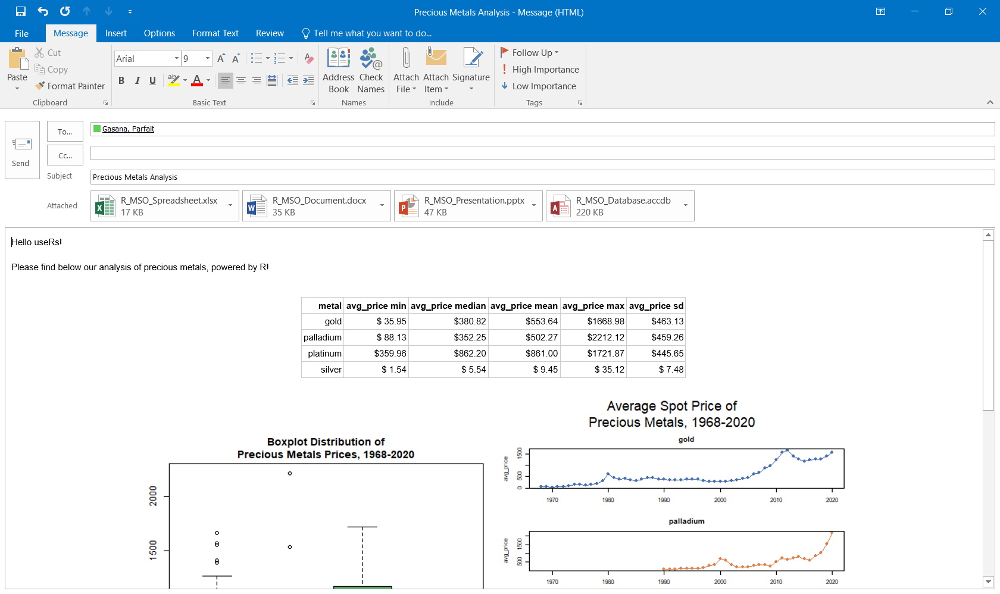

<style type="text/css">
.main-container {
  max-width: 1000px;
  margin-left: auto;
  margin-right: auto;
}
</style>

## Parfait Gasana ##
<div style="font-size: 20px;">Data Analyst, Winston & Strawn, LLP</div>
<div style="float:left"></div>
<div style="font-size: 16px;">@Parfait (StackOverflow) | &nbsp;&nbsp;@ParfaitG (GitHub)</div>

<br/>
<br/>


<br/>

# `RDCOMClient::COMCreate()`

- ### [Component Object Model (COM)](https://docs.microsoft.com/en-us/windows/win32/com/component-object-model--com--portal) is a platform-independent, distributed, object-oriented system for creating binary software components that can interact
    - <h4>Microsoft OLE + ActiveX technologies</h4>

- ### COM objects can be created with a variety of programming languages
    - <h4>Including C++, Java, .Net (C#, VB), Python, PHP, R, and VBA</h4>

- ### Package developed and supported by [Omega Hat](http://www.omegahat.net/)
    - <h4>Joint project with the goal of providing a variety of open-source software for statistical applications mainly for statistical lanageus (S, R, and Lisp)</h4>


```{r eval=FALSE}

install.packages("RDCOMClient", repos = "http://www.omegahat.net/R")

library(RDCOMClient)
```

## Use Case Example

### Data

```{r}
metals_df <- readRDS("DATA/Precious_Metals_Prices.rds")
metals_df <- data.frame(with(metals_df, metals_df[order(year, metal),]),
                        row.names = NULL)
tail(metals_df, 10)
```

```{r}
agg_df <- do.call(data.frame, 
                  aggregate(avg_price ~ metal, metals_df, function(x) 
                    c(min=min(x), 
                      median=median(x), 
                      mean=mean(x), 
                      max=max(x),
                      sd=sd(x)))
)

agg_df
```

### Plotting

```{r fig.height = 6, fig.width = 14, fig.align = "center"}
seaborn_palette <- c("#4C72B0", "#DD8452", "#55A868", "#C44E52", "#8172B3", "#937860", 
                     "#DA8BC3", "#8C8C8C", "#CCB974", "#64B5CD", "#4C72B0", "#DD8452")

metal_box_plot <- function() {
  par(mar=c(3, 3, 4, 1), oma=c(0, 0, 3, 0)) 
  boxplot(avg_price ~ metal, metals_df, col=seaborn_palette[1:5], cex.main=1.5,
          main = "Boxplot Distribution of \nPrecious Metals, 1968 - 2020\n")
}

png('IMAGES/Precious_Metals_Plot.png')
  metal_box_plot()
dev.off()

metal_box_plot()
```

```{r fig.height = 10, fig.width = 13, fig.align = "center"}
plt_colors <- as.list(setNames(seaborn_palette[1:5], unique(metals_df$metal)))

metal_year_plot <- function() {
  par(mfrow=c(4,1), mar=c(3, 5, 3, 1), oma=c(0, 0, 5, 0)) 
  by(metals_df, metals_df$metal, function(sub)
    with(sub, {
      plot(year, avg_price, main=sub$metal[[1]], cex.main=1.5, pch=16, col=plt_colors[[sub$metal[[1]]]])
      lines(year, avg_price, col=plt_colors[[sub$metal[[1]]]])
    })
  )
  mtext("Average Spot Price of\nPrecious Metals, 1968-2020", outer = TRUE, cex = 2)
}

png('IMAGES/Precious_Metals_Year.png')
  metal_year_plot()
dev.off()

metal_year_plot()
```


<div style = "float: right"></div>

## Excel

### [Object Library](https://docs.microsoft.com/en-us/office/vba/api/overview/excel/object-model): Workbooks, Worksheets, QueryTables

```{r eval=FALSE}
xlApp <- COMCreate("Excel.Application")
xlWbk <- xlApp$Workbooks()$Add()                                         # CREATE WORKBOOK

xlWks <- xlWbk$Worksheets(1)
xlWks[["Name"]] <- "METALS"
xlQt <- xlWks$QueryTables()$Add(Connection=paste0("TEXT;", csvData), 
                                Destination=xlWks$Range("A1"))           # IMPORT CSV DATA

xlQt[["TextFileParseType"]] <- 1
xlQt[["TextFileCommaDelimiter"]] <- TRUE
xlQt$Refresh()
xlQt$Delete()

xlWbk$SaveAs(paste0(path, "\\R_MSO_Spreadsheet.xlsx"))                   # SAVE AND CLOSE WORKBOOK
xlWbk$Close(TRUE)                                                        # SAVE AND CLOSE WORKBOOK
xlApp$Quit()                                                             # CLOSE COM APP 

# RELEASE RESOURCES
xlQt <- xlWks <- xlWbk <- xlApp <- NULL
rm(xlQt, xlWks, xlWbk, xlApp)
gc()  
```

<div style="text-align:center"></div>

---

<div style = "float: right"></div>
## Word

### [Object Library](https://docs.microsoft.com/en-us/office/vba/api/overview/word/object-model): Documents, Paragraphs, Tables, InlineShapes

```{r eval=FALSE}
wdApp <- COMCreate("Word.Application")
wdDoc <- wdApp$Documents()$Add()                                         # CREATE DOCUMENT

wdDoc$Paragraphs()$Add()
wdDoc$Paragraphs(1)$Range()$InsertAfter("Precious Metals Aggregate Summary")
wdDoc$Paragraphs()$Add()
wdDoc$Paragraphs()$Add()

wdRange <- wdDoc$Content() 
wdRange$Collapse(Direction=0)

wdDoc$Tables()$Add(Range=wdRange, NumRows=6, NumColumns=6)
wdTbl <- wdDoc$Tables(1)
wdTbl[["Style"]] <- "Plain Table 1"

for(j in 1:6) {
    wdTbl$Cell(1,j)$Range()$InsertAfter(gsub("\\.", " ", names(agg_df)[j]))
}

agg_df[,2:6] <- round(agg_df[,2:6],4)

for(i in 2:6) {
  for(j in 1:6) {
    wdTbl$Cell(i,j)$Range()$InsertAfter(as.character(agg_df[i-1, j]))
  } 
}

wdDoc$Paragraphs()$Add()
wdDoc$Content()$InsertAfter("Precious Metals Aggregate Plots")

wdDoc$Characters()$Last()$Select()
wdApp$Selection()$Collapse()

wdApp$Selection()$InlineShapes()$AddPicture(FileName = paste0(path, "\\Precious_Metals_Plot.png"), 
                                            LinkToFile = FALSE,
                                            SaveWithDocument = TRUE)

wdDoc$Paragraphs()$Add()

wdDoc$Characters()$Last()$Select()
wdApp$Selection()$Collapse()

wdApp$Selection()$InlineShapes()$AddPicture(FileName = paste0(path, "\\Precious_Metals_Year.png"), 
                                            LinkToFile = FALSE,
                                            SaveWithDocument = TRUE)

wdDoc$SaveAs(paste0(path, "\\R_MSO_Document.docx"))                      # SAVE AND CLOSE DOCUMENT
wdDoc$Close(TRUE)                                                        # SAVE AND CLOSE DOCUMENT
wdApp$Quit()                                                             # QUIT COM APP 

# RELEASE RESOURCES
wdRange <- wdPara <- wdTbl <- wdDoc <- wdApp <- NULL
rm(wdRange, wdPara, wdTbl, wdDoc, wdApp)
gc()  
```

<div style="text-align:center"></div>

---

<div style = "float: right"></div>

## PowerPoint

### [Object Library](https://docs.microsoft.com/en-us/office/vba/api/overview/powerpoint/object-model): Presentations, Slides, Shapes, Table

```{r eval=FALSE}
pptApp <- COMCreate("PowerPoint.Application")

pptPres <- pptApp$Presentations()$Add(FALSE)                             # CREATE PRESENTATION
pptSlide <- pptPres$Slides()$Add(Index=1, Layout=1)
pptSlide$Shapes(1)[["TextFrame"]][["TextRange"]]$InsertAfter("Precious Metals Analysis")
pptSlide$Shapes(2)[["TextFrame"]][["TextRange"]]$InsertAfter("Powered by R")

pptSlide <- pptPres$Slides()$Add(Index=2, Layout=16)

pptSlide$Shapes(1)[["TextFrame"]][["TextRange"]]$InsertAfter("Precious Metals Avg Price Aggregation")
pptTbl <- pptSlide$Shapes()$AddTable(6, 6)

for(j in 1:6) {
  pptTbl$Table()$Cell(1, j)$Shape()[["TextFrame"]][["TextRange"]]$InsertAfter(gsub("\\.", " ", names(agg_df)[j]))
}

for(i in 2:6) {
  for(j in 1:6) {
    pptTbl$Table()$Cell(i, j)$Shape()[["TextFrame"]][["TextRange"]]$InsertAfter(as.character(agg_df[i-1, j]))
  } 
}

pptSlide <- pptPres$Slides()$Add(Index=3, Layout=29)
pptSlide$Shapes(1)[["TextFrame"]][["TextRange"]]$InsertAfter("Precious Metals Avg Price Plotting")
pptSlide$Shapes()$AddPicture(FileName = paste0(path, "\\Precious_Metals_Plot.png"),
                             LinkToFile = FALSE,
                             SaveWithDocument = TRUE,
                             Left = 100,
                             Top = 100)

pptSlide$Shapes()$AddPicture(FileName = paste0(path, "\\Precious_Metals_Year.png"),
                             LinkToFile = FALSE,
                             SaveWithDocument = TRUE,
                             Left = 100,
                             Top = 100)

pptPres$SaveAs(paste0(path, "\\R_MSO_Presentation.pptx"))                # SAVE AND CLOSE PRESENTATION
pptApp$Presentations(paste0(path, "\\R_MSO_Presentation.pptx"))$Close()  # CLOSE PRESENTATION
pptApp$Quit()                                                            # QUIT APP

# RELEASE RESOURCES
pptTitle <- pptTbl <- pptSlide <- pptPres <- pptApp <- NULL
rm(pptTitle, pptTbl, pptSlide, pptPres, pptApp)
gc()  
```

<div style="text-align:center"></div>

---

<div style = "float: right"></div>

## Access

### [Object Library](https://docs.microsoft.com/en-us/office/vba/api/overview/access/object-model): DBEngine, Workspace, CurrentDatabase, DoCmd

```{r eval=FALSE}
accApp <- COMCreate("Access.Application")

dbEngine <- accApp$DBEngine()
workspace <- dbEngine$Workspaces(0)

accDB <- workspace$CreateDatabase(paste0(path, "\\R_MSO_Database.accdb"),     
                                  ";LANGID=0x0409;CP=1252;COUNTRY=0", 64)       # CREATE DATABASE

accApp$OpenCurrentDatabase(paste0(path, "\\R_MSO_Database.accdb"))              # OPEN DATABASE
accApp$DoCmd()$TransferText(0, TableName="metals", FileName = csvData,
                            HasFieldNames = TRUE)                               # IMPORT CSV
accApp$DoCmd()$CloseDatabase()                                                  # CLOSE DATABASE
accApp$Quit()                                                                   # QUIT COM APP

# RELEASE RESOURCES
dbEngine <- workspace <- conn <- output <- accDB <- accApp <- NULL
rm(dbEngine, workspace, conn, output, accDB, accApp)
gc()
```

<div style="text-align:center"></div>

---

<div style = "float: right"></div>

## Outlook

### [Object Library](https://docs.microsoft.com/en-us/office/vba/api/overview/outlook/object-model): Item, Body, Recipeints, Subject, Attachments

```{r eval=FALSE}
olApp <- COMCreate("Outlook.Application")
olMail <- olApp$CreateItem(0)                                         # CREATE EMAIL

olHdr <- paste0("<tr><th>", paste(gsub("\\.", " ", names(agg_df)), collapse="</th><th>"), "</th></tr>",
                collapse="")
olTbl <- paste0(apply(agg_df, 1, function(row) paste0("<tr><td>", paste0(row, collapse="</td><td>$"), "</td></tr>")),
                collapse="")

olMail$GetInspector()
signature <- olMail[["HTMLBody"]]                                   
olMail[["Recipients"]]$Add("pgasana@winston.com")                     # EDIT EMAIL CONTENT
olMail[["Subject"]] <- "some subject"

olAttachments <- olMail$Attachments()
olAttachments$Add(paste0(path, "\\R_MSO_Spreadsheet.xlsx"), 1)
olAttachments$Add(paste0(path, "\\R_MSO_Document.docx"), 1)
olAttachments$Add(paste0(path, "\\R_MSO_Presentation.pptx"), 1)
olAttachments$Add(paste0(path, "\\R_MSO_Database.accdb"), 1)
olAttachments$Add(paste0(path, "\\Precious_Metals_Plot.png"), 1, 0)
olAttachments$Add(paste0(path, "\\Precious_Metals_Year.png"), 1, 0)

olMail[["HTMLBody"]] <- paste0('<html>',
                               '<head>',
                               '<style type="text/css">
                                   .aggtable {font-family: Arial; font-size: 12px; border-collapse: collapse;}
                                   .aggtable th, .aggtable td {border: 1px solid #CCC; text-align: right; padding: 2px;}
                                   .aggtable tr:nth-child(even) {background-color: #f2f2f2;}
                               </style>',
                               '</head>',
                               '<body style="font-family: Arial; font-size: 12px;">',
                               '<p>Hello CRUG useRs!<br/><br/>', 
                               '<p>Please find below our analysis of precious metals, powered by R!</p>',
                               '<br/><div style="text-align: center;"/>',
                               '<table class="aggtable">',
                               olHdr,
                               olTbl,
                               '</table><br/>',
                               '<br/>',
                               '',
                               '</div>',
                               signature, '</p>',
                               '</body></html>')

olMail$Display()                                                      # DISPLAY EMAIL

# RELEASE RESOURCES
signature <- olTbl <- olAttachments <- olMail <- olApp <- NULL
rm(signature, olTbl, olAttachments, olMail, olApp)                   
gc()  
```

<div style="text-align:center"></div>

---

<br/>

<br/>
