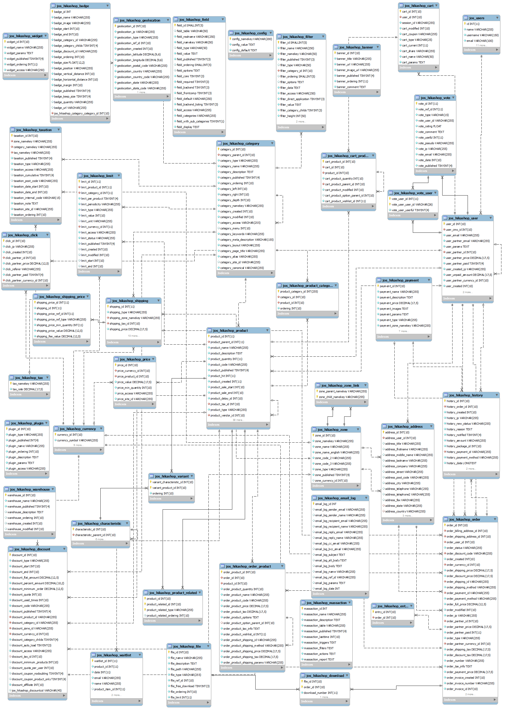
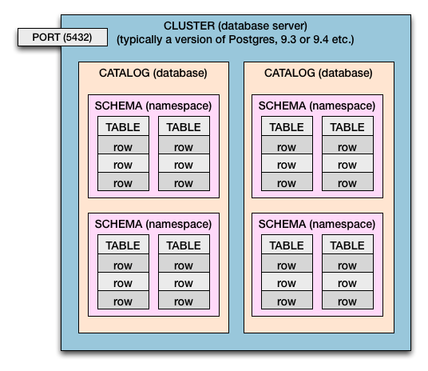

  
```{r setup, include=FALSE}
knitr::opts_chunk$set(echo = FALSE)
```

## The Database

- *What is a Database?*
    - An organized form of information.

- *What is a Relational Database Management System (RBDMS)?*
    - Proprietary or open source software designed to maintain and manage structured data
    - Data is stored in logically grouped tables of rows and columns within an interconnected system of relational keys (i.e., primary/foreign keys)
    - Relational model based on IBM's Edgar F. Codd's 1970 paper, ["A Relational Model of Data for Large Shared Data Banks"](http://www.seas.upenn.edu/~zives/03f/cis550/codd.pdf) 


## Database Schema - Simple
<div class="wrapper"></div>  
  
## Database Schema - Moderate
<div class="wrapper"></div>  
  
## Database Schema - Moderate
<div class="wrapper"></div>  
  
## Database Schema - Complex
<div class="wrapper"></div>  
  
## Postgres Architecture
<div class="wrapper"></div> 
  
## Why use a Database?

- Data persistence: historical and current needs
- Maintenance/hygiene: adherence to types with less munging/cleaning
- Storage efficiency: normalization reduces repetition of data
- Centralization: multiple user environment and security
- Scalability: not limited to local resources

<div class="wrapper"></div> 

## What is SQL?

- SQL (Structured Query Language) is a special purpose, declarative language designed to define and manage database objects and data
- Initially developed by IBM's Chamberlin and Boyce
    - Inspired by Codd's relational model: [Early History of SQL](https://ieeexplore.ieee.org/stamp/stamp.jsp?reload=true&tp=&arnumber=6359709)
    - Rooted in relational algebra but in a readable form free from mathematical concepts
- Being declarative (non-procedural), SQL does not detail how processing is to be done but passes commands to the optimizing compiler

## Typical SQL

-- UNIT LEVEL QUERY
```
        SELECT column1, column2, column3
        FROM table1 t1.
        INNER JOIN table2 t2 ON t1.matchcolumn = t2.matchcolumn
        WHERE column1 = condition1
        ORDER BY column1, column2
```

-- AGGREGATE QUERY
```
        SELECT column1, column2, SUM(column3) As Sum_of_Column3
        FROM table1
        INNER JOIN table2 t2 ON t1.matchcolumn = t2.matchcolumn
        WHERE column1 = condition
        GROUP column1, column2
        HAVING SUM(column3) = condition
        ORDER BY column1, column2, SUM(column3) DESC
```

## Major RDBMS
<div class="wrapper"></div>  
  
- Proprietary
    - Oracle: first commercially successful RDBMS, 1979
    - DB2: began exclusively on main frames
    - SQL Server: began as a Sybase project
    - Others: MS Access, Teradata, SAP ASE

- Open Source
    - PostgreSQL: advanced level object-RDBMS
    - MySQL: popular in web development, part of LAMP stack
    - SQLite: file-level, used in OS, browsers, and mobile apps


## Programming Interfaces
<div class="wrapper"></div>  
  
- Most programming languages support RDBMS connections
- Some languages maintain consistent DB-API specifications and standards:
    - Java: JDBC
    - C++: SQLAPI++
    - NET: ODBC/OLEDB
    - PHP: PDO
    - Python: PEP 249
    - Perl, Ruby, R: DBI

## R DB-APIs

- General: RJDBC, RODBC, odbc
- Specific: 
    - DBI standard - ROracle, RPostgreSQL, RMySQL, RSQLite
    - Standalone - ibmdbr, mssqlr

| Capability   | SQL Command                           | R DBI Command                    |
| :----------: |:-------------------------------------:|:--------------------------------:|
| Import data  |`SELECT`                               | `dbReadTable()`, `dbGetQuery()`  |
| Run actions  |`ALTER`,  `UPDATE`, `DELETE`, `EXECUTE`| `dbSendQuery()`, `dbGetQuery()`  |
| Export data  |`DROP`, `CREATE`, `INSERT`             | `dbWriteTable()`                 |


## RPostgreSQL API
<div class="lwrapper"></div>
  
- Began in 2008 Google Summer of Code by Sameer Kuma Prayaga
- Developers: Sameer Kumar Prayaga, Joe Conway, Neil Tiffin, Dirk Eddelbuettel
- Lead Maintainer: Tomoaki Nishiyama on [Github](https://github.com/tomoakin/RPostgreSQL)
- Highlights: implemented all DBI features, transaction support, type mapping for dates/timestamps
- Others: RPostgres, rpg, rpgsql, Postgres+GIS
  
## Typical Use
```{r echo = TRUE, eval=FALSE}
    library(RPostgreSQL)

    # CONNECT
    conn <- dbConnect(PostgreSQL(), host="192.168.1.1", dbname="mydatabase",
                      user="myuser", password="****", port=5432)

    # PREPARED STATEMENT
    sql <- "SELECT t.col1, t.col2, t.col3 
            FROM mytable t 
            WHERE t.col1 = ?PARAM"

    # BIND PARAMETER
    query <- sqlInterpolate(conn, sql, PARAM = "value")

    # RUN QUERY
    df <- dbGetQuery(conn, strSQL)

    # DISCONNECT
    dbDisconnect(conn)
```


## Best Practices
  
- Credentials: use configuration files to avoid exposure
- Parameterization: readability, avoid SQL injection, abstracts data and code
- Business Logic: use stored procedures over application layer code (R)
- Client/Server Jobs: build schemas and objects on server, process data on client (R)

<div class="wrapper"></div>

## Meetup Speakers


**Gene Leynes**: Co-Organizer and Data Scientist at City Of Chicago
<br/> *Lessons Learned in Transitioning Oracle to Postgres*


**Adam Dziedzic**: PhD student at University of Chicago, Department of Computer Science
<br/> *Database Loading and Migration for PostgreSQL and Other Databases*


