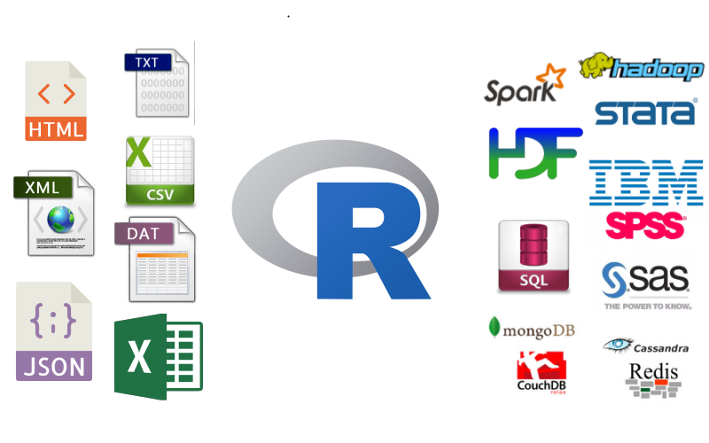

<div style="font-size: 22px;">SatRday Chicago, April 27, 2019</div>

## Parfait Gasana ##
<div style="font-size: 20px;">Data Analyst, Winston & Strawn</div>
<div style="float:left"></div>
<div style="font-size: 16px; padding: 10px 0 0 0;">&nbsp;&nbsp;@ParfaitG (GitHub)</div>

<style type="text/css">
div.blue pre { background-color: #EBF4FA; }
.main-container {
  max-width: 1000px;
  margin-left: auto;
  margin-right: auto;
}
</style>

```{r setup, include=FALSE}
library(yaml)
library(ggplot2)
library(scales)

knitr::opts_chunk$set(echo = TRUE)
options(scipen=999)

config = yaml.load_file("dbconfig.yaml")

seaborn_palette <- c('#4878d0', '#ee854a', '#6acc64', '#d65f5f', '#956cb4', '#8c613c', 
                     '#dc7ec0', '#797979', '#d5bb67', '#82c6e2', '#4878d0', '#ee854a', 
                     '#6acc64', '#d65f5f', '#956cb4', '#8c613c', '#dc7ec0', '#797979', 
                     '#d5bb67', '#82c6e2', '#4878d0', '#ee854a', '#6acc64', '#d65f5f')

```

<br/>
<br/>

------

## R as an Extendable Environment

- ### Flat file and binary formats: csv, txt, json, XML, HTML, Excel, HDF5
- ### API/Language Interface: curl, httr, ssh, docker, Rcpp, rJava, SparkR
- ### Remote Integrations: ssh, network, server, cloud computing

<center></center> 

------

<br/>

## Relational Databases
<center></center>  

- ### Commercial or open source software designed to maintain and manage structured data
- ### Based on relational model of IBM's Edgar F. Codd
    - #### Data is stored in logically grouped tables within a system of relational keys
- ### Mainstay in software and web applications but not in data science

------

<br/>

## Advantages of Relational Databases in Data Science

- ### Data persistence: historical and current needs
- ### Data hygiene: adherence to types with less munging/cleaning
- ### Storage efficiency: normalization reduces repetition of data
- ### Centralization: multiple user environment and security
- ### Scalability: not limited to local resources

------

<br/>

## Programming Interfaces
<center></center> 
  
- ### Most programming languages support RDBMS connections
- ### Some languages maintain consistent DB-API specifications and standards:
    - #### Java: JDBC; C++: SQLAPI++; NET: ODBC/OLEDB; PHP: PDO; Python: DBAPI; Perl, Ruby, R: DBI

------

<br/>

## R DBI Standard

<div style="float:right"></div>

- ### General: RJDBC, odbc
    - #### Requires corresponding JDBC/ODBC drivers
- ### Specific: 
    - #### DBI standard - ROracle, RPostgreSQL, RMySQL, RSQLite

------

<br/>

## Use Cases 

<center></center> 

- ### CTA Bus and Rail Ridership with PostgreSQL
- ### Divvy Trips with IBM DB2
- ### Metra On-Time Performance with SQLite

------

<br/>

## <span style="color:#336791">CTA Bus/Rail Aggregation</span>

<center></center>

- ### <span style="color:#336791">Clear, compact declarative language with portability</span> ####
- ### <span style="color:#336791">Processing with virtual tables occurs behind the scene</span> ###
- ### <span style="color:#336791">Set-based framework facilitates blockwise, vectorized process</span> ###

```{r}
library(DBI)
library(RPostgreSQL)

# CONNECT
conn <- dbConnect(RPostgreSQL::PostgreSQL(), host=config$pg_conn$host, dbname=config$pg_conn$name,
                  user=config$pg_conn$user, password=config$pg_conn$pwd, port=config$pg_conn$port)
```

```{r}
# R AGGREGATION (MULTIPLE FUNCS)
# do.call(data.frame, 
#        aggregate(rides ~ route + routename, agg_csv,
#                  function(x) c(count=length(x), sum=sum(x), mean=mean(x),
#                                median=median(x), min=min(x), max=max(x))))

# POSTGRES AGGREGATION
sql <- 'SELECT rt.route_name, 
               COUNT(rd.rides) AS "count", 
               SUM(rd.rides) AS "sum", 
               AVG(rd.rides) AS "mean", 
               MEDIAN(rd.rides) AS "median",
               R_MEDIAN(rd.rides) AS "r_median",
               MIN(rd.rides) AS "min", 
               MAX(rd.rides) AS "max"
        FROM bus_routes rt
        INNER JOIN bus_rides rd ON rt.route_id = rd.route_id
        GROUP BY rt.route_name
        ORDER BY SUM(rd.rides) DESC
        LIMIT 10'

agg_sql <- dbGetQuery(conn, sql)

knitr::kable(agg_sql)
```

------


### Graphing
```{r fig1, fig.height = 5, fig.width = 10, fig.align = "center"}
ggplot(agg_sql, aes(route_name, sum, fill=route_name)) + geom_col(position = "dodge") +
  labs(title="CTA Top 10 Bus Routes by Ridership", x="Year", y="Rides") +
  scale_y_continuous(expand = c(0, 0), label=comma, limit=c(0,2E8)) + guides(fill=FALSE) +
  scale_fill_manual(values=seaborn_palette) +
  theme(legend.position="bottom",
        plot.title = element_text(hjust=0.5, size=18),
        axis.text.x = element_text(angle=0, hjust=0.5))
```

------


## <span style="color:#336791">Calculation + Aggregation</span>

- ### <span style="color:#336791">CTEs clearly show underlying tables and views without helper objects</span> ###
- ### <span style="color:#336791">Window functions allow useful inline calculations</span> ###
- ### <span style="color:#336791">Complex processing still readable and maintainable</span> ###

```{r}
sql <- 'WITH station_agg AS
         (SELECT DATE_PART(\'year\', r.ride_date)::integer AS "year",
                 r.station_id,
                 r.station_name,
                 COUNT(r.rides)::numeric(20,5) AS "count", 
                 SUM(r.rides)::numeric(20,5) AS "sum", 
                 AVG(r.rides)::numeric(20,5) AS "mean", 
                 MEDIAN(r.rides)::numeric(20,5) AS "median",
                 MIN(r.rides)::numeric(20,5) AS "min", 
                 MAX(r.rides)::numeric(20,5) AS "max"
          FROM rail_rides r
          GROUP BY DATE_PART(\'year\', r.ride_date),
                   r.station_id,
                   r.station_name
          ),
                   
      merge_rail AS
         (SELECT s.*, 
                 r.rail_line,
                 (s."sum" / COUNT(*) OVER(PARTITION BY s.station_id, "year")) AS rail_total
          FROM station_agg s
          INNER JOIN rail_stations r ON s.station_id = r.station_id
         )
         
      SELECT m."year", m.rail_line, SUM(m.rail_total)  AS rail_total
      FROM merge_rail m
      GROUP BY m."year", m.rail_line
      ORDER BY m.rail_line, m."year"'
  
agg_sql <- dbGetQuery(conn, sql)

knitr::kable(agg_sql[sample(1:nrow(agg_sql), 20),])
```

------

### Graphing

```{r fig2, fig.height = 6, fig.width = 10, fig.align = "center"}

cta_palette <- c(blue="#00A1DE", brown="#62361B", green="#009B3A", orange="#F9461C", pink="#E27EA6",
                 purple="#522398", purple_exp="#8059BA", red="#C60C30", yellow="#F9E300")

ggplot(agg_sql, aes(year, rail_total, color=rail_line)) + 
  geom_line(stat="identity") + geom_point(stat="identity") +
  labs(title="CTA Rail Ridership By Year", x="Year", y="Rides") +
  scale_x_continuous("year", breaks=unique(agg_sql$year)) +
  scale_y_continuous(expand = c(0, 0), label=comma) +
  scale_color_manual(values = cta_palette) +
  theme(legend.position="bottom",
        plot.title = element_text(hjust=0.5, size=18),
        axis.text.x = element_text(angle=0, hjust=0.5))
```

------

## <span style="color:#336791">Modeling</span>

- ### <span style="color:#336791">Advanced preparation of data</span>
- ### <span style="color:#336791">Materialized view facilitates reproducible research</span>
- ### <span style="color:#336791">Compact and straightforward data sourcing</span>


```{sql, eval=FALSE}
CREATE MATERIALIZED VIEW Rail_Model_Data AS
    SELECT r.id, r.station_id, r.station_name, r.ride_date, r.day_type, r.rides AS raw, 
          (r.rides / COUNT(*) OVER(PARTITION BY r.station_id, r.ride_date)) AS rides,
          CASE 
               WHEN r.normalized_date BETWEEN '2099-01-01' AND '2099-03-19' THEN 'winter'
               WHEN r.normalized_date BETWEEN '2099-03-20' AND '2099-06-19' THEN 'spring'
               WHEN r.normalized_date BETWEEN '2099-06-20' AND '2099-09-19' THEN 'summer'
               WHEN r.normalized_date BETWEEN '2099-09-20' AND '2099-12-19' THEN 'fall'
               WHEN r.normalized_date BETWEEN '2099-12-20' AND '2099-12-31' THEN 'winter'
               ELSE NULL
           END As season,        
           REPLACE(REPLACE((regexp_split_to_array(s.location, '\s+'))[1], ',', ''), '(', '')::numeric AS latitude,
           REPLACE((regexp_split_to_array(s.location, '\s+'))[2], ')', '')::numeric AS longitude,
           s.rail_line, s.ada, s.direction,
           ue.ue_rate, g.gas_price, w.avg_temp, w.precipitation, w.snow_depth
    FROM 
       (
        SELECT id, station_id, station_name, day_type, rides, ride_date, 
               ride_date + (2099 - date_part('year', ride_date)  ||' year')::interval as normalized_date
        FROM rail_rides
       )r
    INNER JOIN rail_stations s ON s.station_id = r.station_id
    INNER JOIN unemployment_rates ue ON ue.ue_date = r.ride_date
    INNER JOIN gas_prices g ON g.gas_date = r.ride_date
    INNER JOIN weather_data w ON w.weather_date = r.ride_date
    ORDER BY r.ride_date, r.station_id;
    
REFRESH MATERIALIZED VIEW Rail_Model_Data;
```

```{r}
rail_model_data <- dbGetQuery(conn, "SELECT * FROM rail_model_data")

head(rail_model_data)

model <- lm(rides ~ day_type + season + latitude + longitude + rail_line + 
                    ue_rate + gas_price + avg_temp + precipitation + snow_depth, 
            data = rail_model_data)

summary(model)
```

```{r fig3, fig.height = 6, fig.width = 10, fig.align = "center"}
graph_data <- data.frame(param = names(model$coefficients[-1]),
                         value = model$coefficients[-1],
                         row.names = NULL)

ggplot(graph_data) + geom_col(aes(x=param, y=value, fill=param), position = "dodge") +
  labs(title="CTA System Rail Regression Point Estimates", x="Parameters", y="Value") +
  guides(fill=FALSE) + ylim(-4000, 2000) + 
  scale_fill_manual(values = seaborn_palette) +
  theme(legend.position="bottom",
        plot.title = element_text(hjust=0.5, size=18),
        axis.text.x = element_text(angle=45, vjust=0.95, hjust=0.95))
```


```{r}
# DISCONNECT FROM DATABASE
dbDisconnect(conn)
```

------

<br/>

## Divvy Time and Distance Calculation

<center></center>

- ### <span style="color:#336791">Seamless data type integration (i.e., timestamps, coordinates)</span>
- ### <span style="color:#336791">Query specific records without large in-memory footprint</span>
- ### <span style="color:#336791">Better handle calculations and indicator conversions</span>

  
```{r}
options(connectionObserver = NULL)

library(odbc)

conn <- dbConnect(odbc::odbc(),
                  instance = config$db2_conn$instance,
                  driver = config$db2_conn$driver,
                  database = config$db2_conn$database,
                  server = config$db2_conn$server,
                  hostname = config$db2_conn$hostname,
                  port = config$db2_conn$port,
                  uid = config$db2_conn$uid,
                  pwd = config$db2_conn$pwd,
                  LongDataCompat = 1)
```

```{r}
day_df <- dbGetQuery(conn, "SELECT t.START_TIME, t.STOP_TIME,
                                   t.TRIP_DURATION
                            FROM TRIPS t
                            WHERE DATE(t.START_TIME) = TO_DATE('2015-09-23', 'YYYY-MM-DD')
                            ORDER BY t.START_TIME")

knitr::kable(head(day_df, 20))
```

```{r divvy1a, fig.height = 5, fig.width = 10, fig.align = "center"}
ggplot(day_df, aes(START_TIME, TRIP_DURATION)) + geom_line(color=seaborn_palette[1]) +
  xlab("Start Time") + ylab("Trip Duration")
```


```{r}
agg_sql <- dbGetQuery(conn, "WITH sub AS 
                                (SELECT t.FROM_STATION_ID, t.FROM_STATION_NAME,
                                        t.FROM_LATITUDE, t.FROM_LONGITUDE,
                                        ROUND(CASE 
                                                   WHEN t.TO_LATITUDE IS NOT NULL AND t.FROM_LATITUDE IS NOT NULL
                                                   THEN
                                                        3963.1 * (2 * ATAN(1) - 
                                                                  ASIN(SIN(RADIANS(t.FROM_LATITUDE)) * SIN(RADIANS(t.TO_LONGITUDE)) + 
                                                                       COS(RADIANS(t.FROM_LATITUDE)) * COS(RADIANS(t.TO_LONGITUDE)) * 
                                                                       COS(RADIANS(t.TO_LONGITUDE - t.FROM_LONGITUDE))
                                                                      ) 
                                                                 )
                                                   ELSE NULL
                                              END, 4) AS TRIP_DISTANCE
                                 FROM TRIPS t
                                 WHERE DATE(t.START_TIME) = TO_DATE('2015-09-23', 'YYYY-MM-DD'))
                            
                            SELECT FROM_STATION_ID, FROM_STATION_NAME, 
                                   FROM_LATITUDE, FROM_LONGITUDE,
                                   MIN(TRIP_DISTANCE) AS MIN_DISTANCE,
                                   MAX(TRIP_DISTANCE) AS MAX_DISTANCE
                            
                            FROM sub 
                            GROUP BY FROM_STATION_ID, FROM_STATION_NAME, 
                                     FROM_LATITUDE, FROM_LONGITUDE
                            ORDER BY MAX(TRIP_DISTANCE) DESC
                            FETCH FIRST 10 ROWS ONLY;")

knitr::kable(agg_sql)
```

### Mapping

```{r}
divvy_from <- dbGetQuery(conn, "SELECT t.FROM_STATION_NAME, 
                                       t.FROM_LATITUDE, 
                                       t.FROM_LONGITUDE,
                                       SUM(t.TRIP_DURATION) AS Total_Duration,
                                       MIN(t.TRIP_DURATION) AS Min_Duration,
                                       AVG(t.TRIP_DURATION) AS Avg_Duration,
                                       MEDIAN(t.TRIP_DURATION) AS Median_Duration,
                                       MAX(t.TRIP_DURATION) AS Max_Duration
                                       
                                FROM TRIPS t
                                GROUP BY t.FROM_STATION_NAME,
                                         t.FROM_LATITUDE, 
                                         t.FROM_LONGITUDE
                                ORDER BY SUM(t.TRIP_DURATION) DESC
                                FETCH FIRST 10 ROWS ONLY;")
knitr::kable(divvy_from)
```

```{r divvy2, fig.height = 6, fig.width = 12, fig.align = "center"}
ggplot(transform(divvy_from, FROM_STATION_NAME=gsub("&", "\n&", FROM_STATION_NAME)),
                 aes(FROM_STATION_NAME, TOTAL_DURATION, fill=FROM_STATION_NAME)) +
  geom_col(position = "dodge") +
  labs(title="Divvy Top 10 Origination Stations", x="Station", y="Trip Duration (seconds)") +
  scale_y_continuous(expand = c(0, 0), label=comma) + guides(fill=FALSE) +
  scale_fill_manual(values=seaborn_palette) +
  theme(legend.position="bottom",
        plot.title = element_text(hjust=0.5, size=18),
        axis.text.x = element_text(angle=0, hjust=0.5))
```


```{r}
divvy_to <- dbGetQuery(conn, "SELECT t.TO_STATION_NAME, 
                                     t.TO_LATITUDE, 
                                     t.TO_LONGITUDE,
                                     SUM(t.TRIP_DURATION) AS Total_Duration,
                                     MIN(t.TRIP_DURATION) AS Min_Duration,
                                     AVG(t.TRIP_DURATION) AS Avg_Duration,
                                     MEDIAN(t.TRIP_DURATION) AS Median_Duration,
                                     MAX(t.TRIP_DURATION) AS Max_Duration
                                   
                            FROM TRIPS t
                            WHERE TO_STATION_NAME <> 'DIVVY Map Frame B/C Station'
                            GROUP BY t.TO_STATION_NAME,
                                     t.TO_LATITUDE, 
                                     t.TO_LONGITUDE
                            ORDER BY SUM(t.TRIP_DURATION) DESC
                            FETCH FIRST 10 ROWS ONLY;")
knitr::kable(divvy_to)
```

```{r divvy3, fig.height = 6, fig.width = 12, fig.align = "center"}
ggplot(transform(divvy_to, TO_STATION_NAME=gsub("&", "\n&", TO_STATION_NAME)), 
       aes(TO_STATION_NAME, TOTAL_DURATION, fill=TO_STATION_NAME)) +
  geom_col(position = "dodge") +
  labs(title="Divvy Top 10 Destination Stations", x="Station", y="Trip Duration (seconds)") +
  scale_y_continuous(expand = c(0, 0), label=comma) + guides(fill=FALSE) +
  scale_fill_manual(values=seaborn_palette) +
  theme(legend.position="bottom",
        plot.title = element_text(hjust=0.5, size=18),
        axis.text.x = element_text(angle=0, hjust=0.5))
```

```{r}
library(jsonlite)

x <- toJSON(divvy_from[c("FROM_STATION_NAME", "FROM_LATITUDE", "FROM_LONGITUDE")], pretty=TRUE)

# EXPORT TO FILE
fileConn <- file("Divvy_From_Coords.json")
writeLines(x, fileConn)
close(fileConn)

x
```

```{r}
x <- toJSON(divvy_to[c("TO_STATION_NAME", "TO_LATITUDE", "TO_LONGITUDE")], pretty=TRUE)

# EXPORT TO FILE
fileConn <- file("Divvy_To_Coords.json")
writeLines(x, fileConn)
close(fileConn)

x
```


```{r}
# DISCONNECT FROM DATABASE
dbDisconnect(conn)
```


------

<br/>

## <span style="color:#336791">Metra Data Normalization and Testing</span>

<center></center>

- ### <span style="color:#336791">Data hyiene and organization</span>
- ### <span style="color:#336791">Think differently and know your data</span>
- ### <span style="color:#336791">Robust data storage with normalization and relations</span>

<center></center>
<center></center>

```{r}
library(RSQLite)

conn <- dbConnect(RSQLite::SQLite(), dbname=config$sqlite_conn$database)
```


### By Year

```{r}
sql <- "SELECT l.Line, 
               t.Line AS Short,
               CAST(strftime('%Y', Report_Month) AS INT) as Year,
               SUM(t.Late_Trains) AS Total_Late_Trains,
               AVG(t.Late_Trains) AS Avg_Late_Trains
        FROM Trains t
        INNER JOIN Lines l ON t.LineID = l.ID
        WHERE l.Line <> 'SYSTEM'
        GROUP BY l.Line,
                 t.Line,
                 strftime('%Y', t.Report_Month)"

agg_sql <- dbGetQuery(conn, sql)

knitr::kable(agg_sql[sample(1:nrow(agg_sql), 20),])
```

```{r metra1, fig.height = 5, fig.width = 10, fig.align = "center"}
ggplot(agg_sql, aes(Year, Total_Late_Trains, color=Line)) + 
  geom_line(stat="identity") +
  labs(title="Metra Late Trains by Line", x="Year", y="Late Trains") +
  scale_x_continuous("year", breaks=unique(agg_sql$Year)) +
  scale_y_continuous(expand = c(0, 0), label=comma) + guides(fill=FALSE) +
  scale_color_manual(values=seaborn_palette) +
  theme(legend.position="bottom",
        plot.title = element_text(hjust=0.5, size=18),
        axis.text.x = element_text(angle=0, hjust=0.5))
```

------

## Statistical Testing

### T-Tests

```{r}
lines_list <- split(agg_sql, agg_sql$Short)

nms <- lapply(combn(unique(agg_sql$Short), 2, simplify=FALSE), function(i) paste(i, collapse="_"))

res <- t(sapply(combn(unique(agg_sql$Short), 2, simplify=FALSE), function(i) {
  t <- t.test(lines_list[[i[1]]]$Total_Late_Trains, lines_list[[i[2]]]$Total_Late_Trains)
  c(statistic = t$statistic, p_value = t$p.value)
}))

row.names(res) <- nms

knitr::kable(res)

```


### By Month

```{r}
sql <- "SELECT l.ID,
               l.Line, 
               t.Line AS Short,
               CAST(strftime('%m', Report_Month) AS INT) as Month_Num,
               SUM(t.Late_Trains) AS Total_Late_Trains,
               AVG(t.Late_Trains) AS Avg_Late_Trains
        FROM Trains t
        INNER JOIN Lines l ON t.LineID = l.ID
        WHERE l.Line <> 'SYSTEM'
        GROUP BY l.ID,
                 l.Line,
                 t.Line,
                 CAST(strftime('%m', Report_Month) AS INT)
        ORDER BY l.ID,
                 CAST(strftime('%m', Report_Month) AS INT)"

agg_sql <- transform(dbGetQuery(conn, sql), Month = factor(month.abb[Month_Num], levels=month.abb))

knitr::kable(agg_sql[sample(1:nrow(agg_sql), 20),])
```


```{r metra2, fig.height = 4, fig.width = 7, fig.align = "center"}
res <- by(agg_sql, agg_sql$Line, function(sub)
  print(ggplot(sub, aes(Month, Total_Late_Trains, fill=Line)) + 
    geom_col(position = "dodge") +
    labs(title=paste(sub$Line, "-\nLate Trains by Month"), x="Year", y="Late Trains") +
    scale_x_discrete("Month", breaks=unique(agg_sql$Month)) +
    scale_y_continuous(expand = c(0, 0), label=comma) + guides(fill=FALSE) +
    scale_fill_manual(values=seaborn_palette[sub$ID[1]]) +
    theme(legend.position="bottom",
          plot.title = element_text(hjust=0.5, size=18),
          axis.text.x = element_text(angle=0, hjust=0.5)))
)
```


### Correlations

```{r}
sql <- "SELECT CAST(strftime('%Y', c.Report_Month) AS INT) AS Year,
               SUM(CASE WHEN c.Late_Cause = 'Accident' THEN c.Late_Trains ELSE NULL END) AS [Accident],
               SUM(CASE WHEN c.Late_Cause = 'Catenary Failure' THEN c.Late_Trains ELSE NULL END) AS [Catenary],               
               SUM(CASE WHEN c.Late_Cause = 'Freight Interference - Peak' THEN c.Late_Trains ELSE NULL END) AS [Freight Interference Peak],
               SUM(CASE WHEN c.Late_Cause = 'Freight Interference - Off-Peak' THEN c.Late_Trains ELSE NULL END) AS [Freight Interference Off Peak],  
               SUM(CASE WHEN c.Late_Cause = 'Human Error' THEN c.Late_Trains ELSE NULL END) AS [Human Error],                     
               SUM(CASE WHEN c.Late_Cause = 'Lift Deployment' THEN c.Late_Trains ELSE NULL END) AS [Lift Deployment],                
               SUM(CASE WHEN c.Late_Cause = 'Locomotive Failure' THEN c.Late_Trains ELSE NULL END) AS [Locomotive Failure],              
               SUM(CASE WHEN c.Late_Cause = 'Non-Locomotive Equipment Failure' THEN c.Late_Trains ELSE NULL END) AS [Non-Locomotive Equipment Failure], 
               SUM(CASE WHEN c.Late_Cause = 'Obstruction/Debris' THEN c.Late_Trains ELSE NULL END) AS [Obstruction_Debris],              
               SUM(CASE WHEN c.Late_Cause = 'Other' THEN c.Late_Trains ELSE NULL END) AS [Other],                            
               SUM(CASE WHEN c.Late_Cause = 'Passenger Loading' THEN c.Late_Trains ELSE NULL END) AS [Passenger Loading],
               SUM(CASE WHEN c.Late_Cause = 'Passenger Train Interference' THEN c.Late_Trains ELSE NULL END) AS [Passenger Train Interference],     
               SUM(CASE WHEN c.Late_Cause = 'Sick, Injured, Unruly Passenger' THEN c.Late_Trains ELSE NULL END) AS [Sick Injured Unruly Passenger],
               SUM(CASE WHEN c.Late_Cause = 'Signal/Switch Failure' THEN c.Late_Trains ELSE NULL END) AS [Signal Switch Failure],           
               SUM(CASE WHEN c.Late_Cause = 'Track Work' THEN c.Late_Trains ELSE NULL END) AS [Track Work],                      
               SUM(CASE WHEN c.Late_Cause = 'Weather' THEN c.Late_Trains ELSE NULL END) AS [Weather]            FROM Causes c 
      GROUP BY CAST(strftime('%Y', c.Report_Month) AS INT);"

wide_sql <- dbGetQuery(conn, sql)

knitr::kable(wide_sql)
```

```{r}
knitr::kable(cor(wide_sql[-1], use = "complete.obs", method="pearson"))
```


```{r}
sql <- "SELECT CAST(strftime('%Y', c.Report_Month) AS INT) AS Year,
               c.Late_Cause,
               SUM(c.Late_Trains) AS Total_Late_Trains
        FROM Causes c
        INNER JOIN Lines l ON c.LineID = l.ID
        WHERE c.Late_Cause IN 
              (SELECT DISTINCT sub_c.Late_Cause 
               FROM Causes AS sub_c 
               WHERE strftime('%Y', sub_c.Report_Month) = '2012')
          AND c.Late_Cause <> 'TOTAL TRAINS DELAYED'
        GROUP BY strftime('%Y', c.Report_Month),
                 c.Late_Cause"

agg_sql <- dbGetQuery(conn, sql)

knitr::kable(agg_sql[sample(1:nrow(agg_sql), 20),])
```


```{r metra3, fig.height = 5, fig.width = 10, fig.align = "center"}
ggplot(subset(agg_sql, Late_Cause != 'Freight Interference - Total'),
              aes(Year, Total_Late_Trains, fill=Late_Cause)) + 
  geom_bar(position = "fill", stat = "identity") +
  labs(title="Metra Late Trains by Cause", x="Year", y="Late Trains") +
  guides(fill=guide_legend(ncol=4)) +
  scale_x_continuous("year", breaks=unique(agg_sql$Year)) +
  scale_y_continuous(labels = scales::percent_format()) +
  scale_fill_manual(values=seaborn_palette) +
  theme(legend.position="bottom",
        plot.title = element_text(hjust=0.5, size=18),
        axis.text.x = element_text(angle=0, hjust=0.5))
```

```{r}
# DISCONNECT FROM DATABASE
dbDisconnect(conn)
```


------


<br/>

## <span style="color:#336791">Conclusion</span> ##

<center></center>  

- ### <span style="color:#336791">Relational databases provide a stable, centralized, repository for data sourcing</span> ###
- ### <span style="color:#336791">Relational databases maintains a proficient query optimizer and set-based language for data processing</span> ###
- ### <span style="color:#336791">Relational databases supports data science by ensuring integrity, best practices, and reproducibility</span> ###

<br/>
<br/>
<br/>


## 

