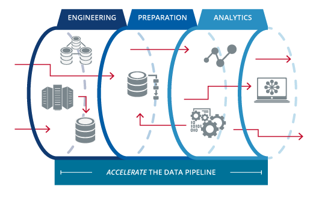

<style type="text/css">
.main-container {
  max-width: 1200px;
  margin-left: auto;
  margin-right: auto;
}

pre {
  font-size: 20px;
}
</style>

<br/>
<div style="font-size: 24px;">Virtual useR! 2020</div>
<div style="float:left"></div>
<br/><br/><br/><br/>

## Parfait Gasana ##
<div style="font-size: 20px;">Data Analyst, Winston & Strawn LLP</div>
<div style="font-size: 16px;">Chicago, IL</div>
<div style="float:left"></div>
<div style="font-size: 16px;">@Parfait (StackOverflow) | &nbsp;&nbsp;@ParfaitG (GitHub)</div>

<hr style="border: none; height: 1px; background-color: #CCC;"/>

```{r setup, include=FALSE}
knitr::opts_chunk$set(root.dir = "/home/parfaitg/Documents/PGSQL")
```

<br/>

<h2>Data Science Challenges</h2>

<div style="float:right"></div>

- <h3>Big Data: volume, variety, velocity, veracity</h3>
- <h3>Data Munging and Wrangling</h3>
<div style="float:right;"></div>
- <h3>Documentation</h3>
- <h3>Reproducibility</h3>
- <h3>Hardware Resources</h3>

<br/>

<hr style="border: none; height: 1px; background-color: #CCC;"/>

<br/>

<h2><span style="color: #336791"/>Relational Database Solution</span></h2>

<div style="float:right;"></div>

- ### <span style="color: #336791"/>Data persistence</span>
- ### <span style="color: #336791"/>Durability and security</span>

<div style="float:right;"></div>

- ### <span style="color: #336791"/>Storage efficiency</span>
- ### <span style="color: #336791"/>Centralization</span>
- ### <span style="color: #336791"/>Scalability</span>

<br/>
<br/>
<br/>
<br/>

<hr style="border: none; height: 1px; background-color: #CCC;"/>

<div style="float:right"><a href="https://hub.docker.com/r/parfaitg/environment_db/tags"></a></div>

## <span style="color: #336791"/>Use Case: Environment Database</a></span>

<h3><span style="color: #336791"/><i>Human Impact on the Global and Local Biosphere and Climate</i></span></h3>
<div style="float:center; text-align:center;"></div>
<br/>

<hr style="border: none; height: 1px; background-color: #CCC;"/>

```{r echo=FALSE}
suppressMessages(library(kableExtra))
suppressMessages(library(xts))

seaborn_palette <- c("#4C72B0", "#DD8452", "#55A868", "#C44E52", "#8172B3", "#937860", 
                     "#DA8BC3", "#8C8C8C", "#CCB974", "#64B5CD", "#4C72B0", "#DD8452")
```

<h2><b><span style="color: #336791"/>Connection</span></b></h2>

### <span style="color: #336791"/><a href="https://www.postgresql.org/ftp/odbc/versions/src/" target="blank">ODBC</a></span>

```{r}
library(DBI)
library(odbc)

conn <- dbConnect(odbc::odbc(), driver="PostgreSQL Unicode", 
                  server="10.0.0.220", database="environment",
                  uid="postgres", pwd="env19", port=6432)
dbListTables(conn)

dbDisconnect(conn)
```

### <span style="color: #336791"/><a href="https://jdbc.postgresql.org/download.html" target="blank">JDBC</a></span>

```{r}
library(rJava)
library(RJDBC)

drv <- JDBC("org.postgresql.Driver",
           "/usr/lib/jvm/java-8-oracle/lib/postgresql-42.2.2.jar")
conn <- dbConnect(drv, "jdbc:postgresql://10.0.0.220:6432/environment", "postgres", "env19")
dbListTables(conn, schema="public")

dbDisconnect(conn)
```


### <span style="color: #336791"/><a href="https://rdrr.io/cran/RPostgreSQL/" target="blank">RPostgreSQL API</a></span>

```{r}
library(RPostgreSQL)

conn <- dbConnect(RPostgreSQL::PostgreSQL(), host="10.0.0.220", dbname="environment",
                  user="postgres", password="env19", port=6432)
dbListTables(conn)
```

<hr style="border: none; height: 1px; background-color: #CCC;"/>

<h2><b><span style="color: #336791"/>Data Migration</span></b></h2>

### <span style="color: #336791"/>Schema</span>

```{sql eval=FALSE}
CREATE TABLE global_temperature (
   id SERIAL NOT NULL PRIMARY KEY,
   year INT,
   period VARCHAR(50),
   global_mean NUMERIC(5,2)
);

COPY global_temperature (year, period, global_mean) FROM '/path/to/csv/global_temperature.csv' DELIMITER ',' CSV HEADER;
```

### <span style="color: #336791"/>Documentation</span>

```{sql eval=FALSE}
COMMENT ON TABLE global_temperature IS 'Source: NASA - Combined Land-Surface Air and Sea-Surface Water Temperature Anomalies (Land-Ocean Temperature Index, LOTI) (https://data.giss.nasa.gov/gistemp/)';
```

```{sql connection=conn, output.var = "comments_df"}
SELECT relname as table, obj_description(oid) as comment
FROM pg_class
WHERE relkind = 'r'
  AND obj_description(oid) IS NOT NULL
  ORDER BY relname
```

```{r echo=FALSE}
kable_styling(kable(comments_df),
              bootstrap_options = c("striped", "hover"))
```

<hr style="border: none; height: 1px; background-color: #CCC;"/>

<div style="float:right"></div>
<div style="float:right"></div>

<h2><b><span style="color: #336791"/>Data Analysis</span></b></h2>

<br/>
<br/>

### <span style="color: #336791"/>Single Aggregation</span>

```{sql connection=conn, output.var = "agg_df"}
SELECT p.date_year,
       sum(p.average_ppm) as carbon_ppm_total, 
       avg(p.average_ppm) as carbon_ppm_mean, 
       sum(c.energy_consumed) as btu_consumed_total,
       avg(c.energy_consumed) as btu_consumed_mean,
       sum(e.energy_co2) as co2_emissions_total,
       avg(e.energy_co2) as co2_emissions_mean
  FROM ppm_month p
  JOIN consumption c 
    ON p.date_year = c.date_year AND p.date_month = c.date_month and c.msn = 'TXRCBUS'
  JOIN us_co2_emissions e
    ON p.date_year = e.date_year AND p.date_month = e.date_month and e.msn = 'TETCEUS'
GROUP BY p.date_year
ORDER BY p.date_year
```

```{r echo=FALSE}
kable_styling(kable(tail(agg_df, 10)),
              bootstrap_options = c("striped", "hover"))
```

### <span style="color: #336791"/>Multiple Join</span>


```{sql connection=conn, output.var = "metrics_df"}
SELECT p.date_year, 
       p.date_month, 
       CONCAT(p.date_year, '-', p.date_month, '-01')::date as date_day,
       p.average_ppm as "carbon ppm", 
       c.energy_consumed as "btu consumed", 
       e.energy_co2 as "co2 emissions"
  FROM ppm_month p
  JOIN consumption c 
    ON p.date_year = c.date_year AND p.date_month = c.date_month and c.msn = 'TXRCBUS'
  JOIN us_co2_emissions e
    ON p.date_year = e.date_year AND p.date_month = e.date_month and e.msn = 'TETCEUS'
  ORDER BY p.date_year, p.date_month
```

### <span style="color: #336791"/>Time Series Plot of Carbon PPM, US Energy Consumption and US CO2 Emissions</span>

```{r fig1a, fig.height = 7, fig.width = 13, fig.align = "center"}
metric_ts <- xts(x=metrics_df[c("carbon ppm", "btu consumed", "co2 emissions")], 
                 order.by=metrics_df$date_day)

plot(metric_ts, main = "Energy and Carbon PPM Metrics",
     legend.loc="bottomright", 
     col = c("red", "blue", "darkgreen"),
     yaxis.right=FALSE,
     axes=FALSE,
     lwd=1,
     cex.main=3,
     major.ticks="years",
     major.format="%Y",
     minor.format="%Y",
     grid.ticks.lty=1)
```


<div style="float:right"></div>
### <span style="color: #336791"/>Renewable Energy: Production and Consumption</span>
<br/>

```{sql connection=conn, output.var="renewable_df"}
SELECT energy_type,
       date,
       SUM(production) AS production,
       SUM(consumption) AS consumption
FROM us_renewable_energy
GROUP BY energy_type,
         date
ORDER BY energy_type,
         date
```

```{r echo=FALSE}
kable_styling(kable(tail(renewable_df)),
              bootstrap_options = c("striped", "hover"))
```

### <span style="color: #336791"/>Multiple Time Series Plots by Energy Type</span>

```{r renewable_fig, fig.height = 15, fig.width = 15, fig.align = "center"}

par(mfrow=c(3,3), mar=c(5, 5, 2, 1))
output <- by(renewable_df, renewable_df$energy_type, function(sub) {
  
  metric_ts <- xts(x=sub[c("production", "consumption")], 
                   order.by=sub$date)
  
  print(plot(metric_ts, main = sub$energy_type[1],
             legend.loc="bottomright", 
             col = seaborn_palette[c(1,4)],
             yaxis.right=FALSE,
             axes=FALSE,
             lwd=1,
             cex.main=3,
             major.ticks="years",
             major.format="%Y",
             minor.format="%Y",
             grid.ticks.lty=1))
  
})
```

### <span style="color: #336791"/>Dual Aggregation</span>

```{sql connection=conn, output.var="consumed_df"}
WITH c1 AS
  (SELECT CONCAT((date_year/10)::int * 10, 's') as decade, 
           REPLACE(description, 'Primary Energy Consumed by the ', '') AS "Sector",
           SUM(energy_consumed) AS "Primary Energy Consumed"
   FROM consumption
   WHERE msn IN ('TXICBUS', 'TXRCBUS', 'TXACBUS', 'TXCCBUS', 'TXEIBUS')
   GROUP BY CONCAT((date_year/10)::int * 10, 's'), 
            REPLACE(description, 'Primary Energy Consumed by the ', '')
  ),
   c2 AS
  (SELECT CONCAT((date_year/10)::int * 10, 's') as decade, 
           REPLACE(REPLACE(description, 'Total Energy ', ''), ' CO2 Emissions', '') AS "Sector",
           SUM(energy_co2) AS "Total CO2 Emissions"
   FROM us_co2_emissions
   WHERE msn IN ('TERCEUS', 'TECCEUS', 'TEACEUS', 'TXEIEUS')
   GROUP BY CONCAT((date_year/10)::int * 10, 's'), 
             REPLACE(REPLACE(description, 'Total Energy ', ''), ' CO2 Emissions', '')
  )

SELECT c1.decade, c1."Sector", c1."Primary Energy Consumed", c2."Total CO2 Emissions"
FROM c1
LEFT JOIN c2
    ON c1."Sector" = c2."Sector" AND c1.decade = c2.decade
ORDER BY c1.decade, c1."Sector"
```

```{r echo=FALSE}
kable_styling(kable(tail(consumed_df)),
              bootstrap_options = c("striped", "hover"))
```

<div style="float:right"></div>
### <span style="color: #336791"/>U.S. Primary Energy Consumption by Sector</span>

<br/>
<br/>

```{r fig1e, fig.height = 6, fig.width = 15, fig.align = "center"}
plot_mat <- with(consumed_df, tapply(`Primary Energy Consumed`, list(decade, `Sector`), sum))
par(mar=c(5, 5, 2, 1))
barplot(plot_mat, main="U.S. Primary Energy Consumption by Sector", cex.main=1.5,
        col=seaborn_palette[1:8], ylim=c(0, 9E5), xaxt="n", yaxt="n", beside=TRUE)

axis(side=1, at=c(5, 14, 23, 32, 41), labels=colnames(plot_mat), padj=0.9, pos=c(0,0))
axis(side=2, at=axTicks(2), labels=format(axTicks(2), big.mark=',', scientific=FALSE), las=1)
legend("top", row.names(plot_mat), fill=seaborn_palette[1:8], ncol=8)
```

### <span style="color: #336791"/>U.S. CO2 Emissions by Sector</span>


```{r fig1g, fig.height = 6, fig.width = 15, fig.align = "center"}
plot_mat <- with(consumed_df, tapply(`Total CO2 Emissions`, list(decade, `Sector`), sum))
plot_mat <- plot_mat[, c("Commercial Sector", "Electric Power Sector", 
                         "Residential Sector", "Transportation Sector"), drop=FALSE]
plot_mat <- plot_mat[complete.cases(plot_mat),,drop=FALSE]

par(mar=c(5, 8, 2, 1))
barplot(plot_mat, main="U.S. CO2 Emissions by Sector", cex.main=1.5,
        col=seaborn_palette[1:5], ylim=c(0, 6E4), xaxt="n", yaxt="n", beside=TRUE)

axis(side=1, at=c(3, 9, 15, 21)+0.5, labels=colnames(plot_mat), padj=0.9, pos=c(0,0))
axis(side=2, at=axTicks(2), labels=format(axTicks(2), big.mark=',', scientific=FALSE), las=1)
legend("top", row.names(plot_mat), fill=seaborn_palette[1:5], ncol=5)
```

### <span style="color: #336791"/>Parameterized Query</span>

```{r}
sql <- "WITH sub AS
          (SELECT CONCAT((date_year/10)::int * 10, 's') as decade, 
                  REPLACE($1, '%', '') as sector,
                  REPLACE(REPLACE(description, 
                                  CONCAT(REPLACE($2, '%', ''), ' CO2 Emissions'), 
                                  ''),
                          ' ', '\n')  AS \"Type\",
                 energy_co2
           FROM us_co2_emissions
           WHERE description LIKE $3)

       SELECT decade, sector, \"Type\", 
              SUM(energy_co2) AS \"Total CO2 Emissions\"
       FROM sub
       GROUP BY decade, sector, \"Type\"
       ORDER BY decade, sector, \"Type\"
       "

params <- paste(c("%Transportation", "%Residential", "%Commercial"), "Sector%")
emissions_type_df <- do.call(rbind, lapply(params, function(p) 
                                            dbGetQuery(conn, sql, param=list(p, p, p))))
```

### <span style="color: #336791"/>U.S. CO2 Emissions Bar Plot by Fuel Type across Sectors</span>

```{r fig1h, fig.height = 5, fig.width = 15, fig.align = "center"}
output <- by(emissions_type_df, emissions_type_df$sector, function(sub) {
  plot_mat <- with(sub, tapply(`Total CO2 Emissions`, list(decade, `Type`), sum))

  barplot(plot_mat, main=paste("U.S. CO2 Emissions by", sub$sector[[1]]), cex.main=1.5,
          col=seaborn_palette[1:5], ylim=c(0, ceiling(max(plot_mat, na.rm=TRUE)/1E4) * 1E4), 
          xaxt="n", yaxt="n", beside=TRUE)
  
  axis(side=1, at=c(3,9,15,21,27,33,39,45,51,57,63)[seq_along(colnames(plot_mat))] + 0.5,
       labels=colnames(plot_mat), padj=0.9, pos=c(0,0))
  axis(side=2, at=axTicks(2), labels=format(axTicks(2), big.mark=',', scientific=FALSE), las=1)
  legend("top", row.names(plot_mat), fill=seaborn_palette[1:5], ncol=5)
})
```

<div style="float:right"></div>
### Global Metrics
<br/>

### <span style="color: #336791"/>Multiple Aggregations</span>

```{sql connection=conn, output.var = "env_world_df"}
WITH pop AS 
  (SELECT p.year,
          p.population
   FROM world_population p
   WHERE p.country_name = 'World'
     AND p.year BETWEEN 2000 AND 2019
   ),
    
    land AS
  (SELECT a.year,
          a.percent_arable
   FROM arable_land a
   WHERE a.country_name = 'World'
     AND a.year BETWEEN 2000 AND 2019
   ),

    fauna AS
  (SELECT i.year,
          SUM(i.species_count) AS animals_count
   FROM iucn_species_count i
   WHERE i.year BETWEEN 2000 AND 2019
   GROUP BY i.year
   ),

    flora AS
  (SELECT p.assessment_year as year,
          COUNT(*) AS plants_count
   FROM plants_assessments p
   WHERE p.assessment_year BETWEEN 2000 AND 2019
     AND p.interpreted_status = 'Threatened'
   GROUP BY p.assessment_year
   ),             

    ice AS
  (SELECT s.date_year as year,
          AVG(s.extent) FILTER(WHERE s.region = 'Arctic') AS arctic_sea_ice_extent,
          AVG(s.extent) FILTER(WHERE s.region = 'Antarctica') AS antarctic_sea_ice_extent
   FROM sea_ice_extent s
   WHERE s.date_year BETWEEN 2000 AND 2019
   GROUP BY s.date_year
   ),
   
    ocean AS
  (SELECT o.year as year,
          AVG(o.tco2) AS total_co2,
          AVG(o.phts25p0) AS ph_scale
   FROM ocean_data o
   WHERE o.year BETWEEN 2000 AND 2019
     AND o.tco2 <> -9999 AND o.phts25p0 <> -9999
   GROUP BY o.year
   ),
   
    temp AS
  (SELECT g.year as year,
          AVG(g.global_mean) AS global_mean
   FROM global_temperature g
   WHERE g.year BETWEEN 2000 AND 2019
   GROUP BY g.year
   )
   
SELECT pop.year, pop.population, land.percent_arable, 
       fauna.animals_count, flora.plants_count,
       ice.arctic_sea_ice_extent, ice.antarctic_sea_ice_extent, 
       ocean.total_co2, ocean.ph_scale, temp.global_mean
FROM pop 
JOIN land USING (year)
JOIN fauna USING (year)
JOIN flora USING (year)
JOIN ice USING (year)
JOIN ocean USING (year)
JOIN temp USING (year)
ORDER BY pop.year
```

```{r echo=FALSE}
kable_styling(kable(tail(env_world_df)), font_size = 12,
              bootstrap_options = c("striped", "hover"))
```

### <span style="color: #336791"/>Scatter Plots of World Population and Other Metrics with LOESS Fit</span>

```{r fig10, fig.height = 15, fig.width = 15, fig.align = "center"}
par(mfrow=c(4,2), mai = c(0.3, 0.2, 0.7, 0.2))

for(x in colnames(env_world_df)[3:ncol(env_world_df)]) {
  lfit <- loess(paste(x, "~ population"), data=env_world_df)
  
  plot(as.formula(paste(x, "~ population")), env_world_df, 
       main=paste("population and\n", gsub("_", " ", x)), cex.main=2,
       type="p", col=seaborn_palette[1], yaxt='n', xaxt='n', pch=19)
  axis(side=1, at=axTicks(1), labels=format(axTicks(1), big.mark=',', scientific=FALSE))
  axis(side=2, at=axTicks(2), labels=format(axTicks(2), big.mark=',', scientific=FALSE))
  pop_order <- order(env_world_df$population)
  lines(env_world_df$population[pop_order], lfit$fitted[pop_order], col=seaborn_palette[4], lwd=3)
}
```

```{r echo=FALSE}
invisible(dbDisconnect(conn))
```

<div style="float:right"></div>

<h2><b><span style="color: #336791"/>Shiny Application</span></b></h2>

<div style="float:center"></div>

```{r}

# LINUX SHELL COMMAND CALL
system(paste0("gnome-terminal -- Rscript -e \"library(shiny); setwd('", 
              getwd(), "'); 
              runApp('Postgres_As_Data_Science_DB_Shiny_App.R')\""))
```

<hr style="border: none; height: 1px; background-color: #CCC;"/>

<br/>
<h2><span style="color: #336791"/>PostgreSQL as tool in data science pipeline</span></h2>

<div style="float:right;"><b></b></div>
<br/>

<div style="float:left;"></div>
<br/>
<br/>

- <h3><span style="color: #336791"/>Robust big data solution</h3>
- <h3><span style="color: #336791"/>Facilitates access and data management</h3>
- <h3><span style="color: #336791"/>Leverages query engine</h3>
- <h3><span style="color: #336791"/>Supports reproducible processs</h3>
- <h3><span style="color: #336791"/>Streamlined open source ecosystem</h3>

<br/>
<br/>
<br/>
<br/>
<br/>
<br/>
<br/>
<br/>


