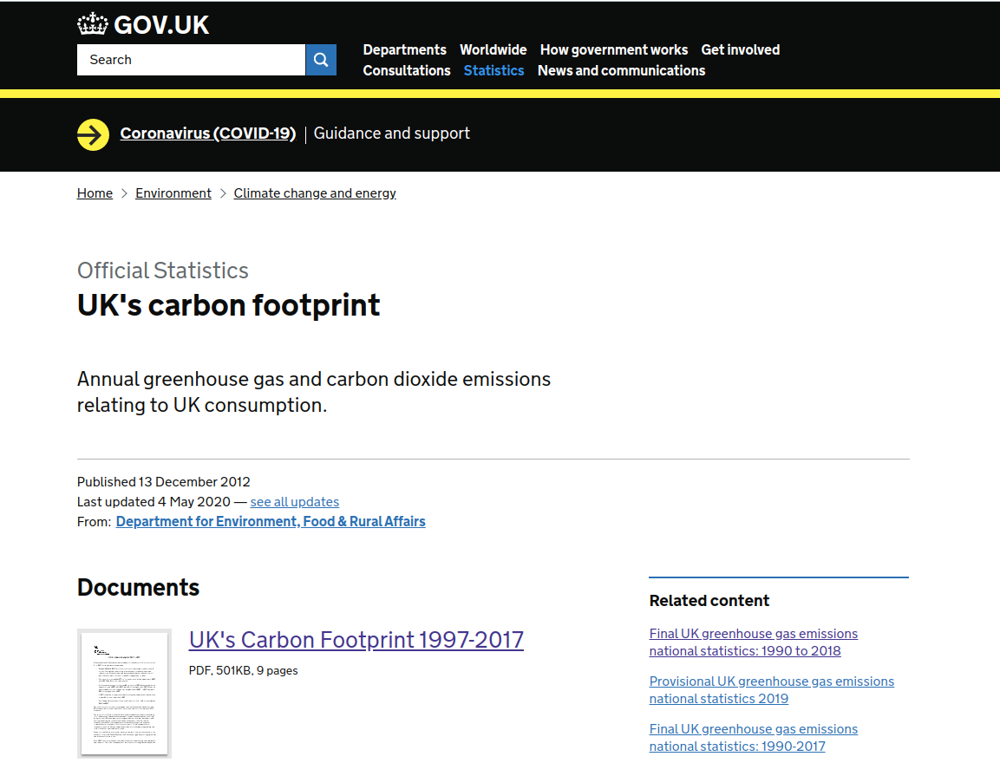

<style type="text/css">
.main-container {
  max-width: 1200px;
  margin-left: auto;
  margin-right: auto;
}
</style>

<br/>
<br/>

```{r setup, include=FALSE}
knitr::opts_chunk$set(echo = TRUE)

library(readODS)

options(scipen=999)

seaborn_palette <- rep(c("#4C72B0", "#DD8452", "#55A868", "#C44E52", "#8172B3",
                         "#937860", "#DA8BC3", "#8C8C8C", "#CCB974", "#64B5CD"), 4)
```

<div style="text-align:center"></div>

```{r}
url <- paste0('https://assets.publishing.service.gov.uk/government/uploads/system/',
              'uploads/attachment_data/file/878044/Data_download_consumption_emissions_1997_2017_v2.ods')

ods_file <- '~/Downloads/Data_download_consumption_emissions_1997_2017_v2.ods'

sheet_names <- list_ods_sheets(ods_file)
data.frame(sheet_names)
```

### UK Emissions by Source Region
```{r}
co2_source_df <- setNames(read_ods(ods_file, sheet="Summary_source_region_90-17", range = "B35:R63"),
                          c("Year", "UK", "Brazil", "Russia", "India", "China", "South_Africa", "USA", "Japan", 
                            "Rest_of_the_EU", "Rest_of_Europe", "Rest_of_the_OECD", "Rest_of_Africa",
                            "Rest_of_America", "Rest_of_Asia", "Rest_of_Middle_East", "Total"))

co2_source_df
```

```{r fig1a, fig.height = 6, fig.width = 12, fig.align = "center"}
par(mar = c(5,6,4,2), las=1)

with(co2_source_df, {
  dat <- as.matrix(co2_source_df)[-1]
  
  plot(Year, UK, type='l', pch=16,
       main="UK CO2 Emissions by Source Region",
       xlab="Year", ylab="Ktonnes CO2\n", font.lab=2,
       ylim=range(pretty(c(0, dat*1.25))),
       col=seaborn_palette[1], bg = "grey90", lwd=2, 
       cex.main=1.5, cex.lab=1.0, cex.axis = 1.0)
  points(Year, UK, pch=20, col=seaborn_palette[1])
  
  sapply(3:ncol(co2_source_df), function(i) {
    lines(Year, co2_source_df[,i], col=seaborn_palette[i])
    points(Year, co2_source_df[,i], pch=20, col=seaborn_palette[i])
  })
  
  legend("top", legend=names(co2_source_df)[-1],
         col=seaborn_palette, ncol=4, lty=1, cex=0.8)
})
```

```{r fig1b, fig.height = 5, fig.width = 13, fig.align = "center"}
par(mar=c(5,5,5,1), las=1)

with(co2_source_df, {
  dat <- tapply(Total, Year, sum)
  
  barplot(dat, beside = TRUE, 
          main = "U.K. Total CO2 Emissions, 1990-2017",
          xlab = "Year", ylab = "Ktonnes CO2\n", 
          ylim=range(pretty(c(0, dat))), font.lab=2, las=2,
          cex.lab=1.0, cex.main=1.5, cex.axis=0.9,
          col=seaborn_palette)
})  
```

### UK CO2 Emissions by Demand

```{r}
co2_demand_df <- read_ods(ods_file, sheet="Summary_final_demand_90-17", range = "B35:K63")

co2_demand_df <- setNames(co2_demand_df, c("Year", gsub("\n", " ", names(co2_demand_df)[2:9]), "Total"))
co2_demand_df
```

```{r fig2a, fig.height = 6, fig.width = 12, fig.align = "center"}
par(mar = c(5,6,4,2), las=1)

with(co2_demand_df, {
  dat <- as.matrix(co2_demand_df)[-1]
  
  plot(Year, Households, type='l', pch=16,
       main="UK CO2 Emissions by Demand",
       xlab="Year", ylab="Ktonnes CO2\n", font.lab=2,
       ylim=range(pretty(c(0, dat*1.25))),
       col=seaborn_palette[1], bg = "grey90", lwd=2, 
       cex.main=1.5, cex.lab=1.5, cex.axis = 1.0)
  points(Year, Households, pch=20, col=seaborn_palette[1])
  
  sapply(3:ncol(co2_demand_df), function(i) {
    lines(Year, co2_demand_df[,i], col=seaborn_palette[i])
    points(Year, co2_demand_df[,i], pch=20, col=seaborn_palette[i])
  })
  
  legend("top", legend=names(co2_demand_df)[-1],
         col=seaborn_palette, ncol=3, lty=1, cex=0.8)
})
```

```{r fig2b, fig.height = 24, fig.width = 13, fig.align = "center"}
par(mar=c(2,5,5,1), mfrow=c(8,1), las=1)

output <- sapply(names(co2_demand_df)[2:9], function(nm) {
  dat <- tapply(co2_demand_df[[nm]], co2_demand_df$Year, sum)
  
  barplot(dat, beside = TRUE, 
          main = paste("U.K. CO2 Emissions by", nm),
          ylab = "Ktonnes CO2\n", ylim=range(pretty(c(0, dat))),
          space=0.4, cex.lab=1.0, cex.main=1.75, cex.axis=1.0,
          col=seaborn_palette)
})  
```

### UK CO2 Emissions by Product

```{r}
co2_product_df <- read_ods(ods_file, sheet="Summary_product_90-17", range = "B35:AJ63")

colnames(co2_product_df)[1] <- "YEAR"
attr(co2_product_df, "full_names") <-  c("Food", "Non-alcoholic beverages", "Alcoholic beverages", "Tobacco", "Clothing", 
                                         "Footwear", "Actual rentals for households", "Imputed rentals for households", 
                                         "Maintenance and repair of the dwelling", "Water supply and miscellaneous dwelling services",
                                         "Electricity, gas and other fuels", "Furniture, furnishings, carpets etc", 
                                         "Household textiles", "Household appliances", "Glassware, tableware and household utensils",
                                         "Tools and equipment for house and garden", "Goods and services for household maintenance",
                                         "Medical products, appliances and equipment", "Hospital services", "Purchase of vehicles",
                                         "Operation of personal transport equipment", "Transport services", "Postal services",
                                         "Telephone and telefax equipment", "Telephone and telefax services", 
                                         "Audio-visual, photo and info processing equipment", 
                                         "Other major durables for recreation and culture", "Other recreational equipment etc",
                                         "Recreational and cultural services", "Newspapers, books and stationery", "Education",
                                         "Restaurants and hotels", "Miscellaneous goods and services", "Total")
co2_product_df
```


```{r fig3a, fig.height = 6, fig.width = 12, fig.align = "center"}
par(mar = c(5,6,4,2), las=1)

with(co2_product_df, {
  dat <- as.matrix(co2_product_df)[-1]
  
  plot(YEAR, FOO, type='l', pch=16,
       main="UK CO2 Emissions by Product",
       xlab="Year", ylab="Ktonnes CO2\n", font.lab=2,
       ylim=range(pretty(c(0, dat*1.25))),
       col=seaborn_palette[1], bg = "grey90", lwd=2, 
       cex.main=1.5, cex.lab=1.5, cex.axis = 1.0)
  points(YEAR, FOO, pch=20, col=seaborn_palette[1])
  
  sapply(3:35, function(i){
    lines(YEAR, co2_product_df[,i], col=seaborn_palette[i])
    points(YEAR, co2_product_df[,i], pch=20, col=seaborn_palette[i])
  })
  
  legend("top", legend=names(co2_product_df)[-1],
         col=seaborn_palette[1:4], ncol=9, lty=1, cex=0.8)
})
```


```{r}

co2_product_df <- within(co2_product_df, {
  
  span_years <- ifelse(YEAR %in% c(1990,1994), "1990-1994",
                       ifelse(YEAR %in% c(1995,1999), "1995-1999",
                              ifelse(YEAR %in% c(2000,2004), "2000-2004",
                                     ifelse(YEAR %in% c(2005,2009), "2005-2009",
                                            ifelse(YEAR %in% c(2010,2014), "2010-2014",
                                                   ifelse(YEAR %in% c(2015,2017), "2015-2017", NA)
                                            )
                                     )
                              )
                       )
  )
  
})

agg_df <- aggregate(. ~ span_years, co2_product_df[-1], FUN=mean)

agg_df
```


```{r fig3, fig.height = 34, fig.width = 12, fig.align = "center"}
par(mar=c(2,5,5,1), mfrow=c(17, 2), las=1)

dat <- `dimnames<-`(as.matrix(agg_df[-1]),
                    list(agg_df$span_years, names(agg_df)[-1]))

output <- sapply(1:ncol(dat), function(i) {
  barplot(dat[,i], beside = TRUE, 
          main = paste("U.K. CO2 Emissions:\n", attributes(co2_product_df)$full_names[i]),
          ylab = "Ktonnes CO2\n", ylim=range(pretty(c(0, dat[,i]))),
          space=0.4, cex.lab=1.0, cex.main=1.5, cex.axis=1.0,
          col=seaborn_palette)
})
```

<br/>
<br/>
<br/>
<br/>
<br/>

