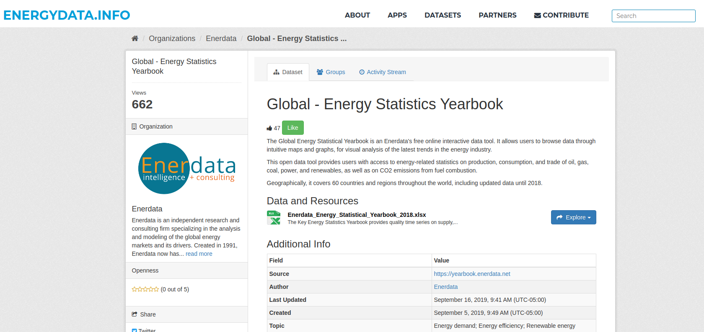

<style type="text/css">
.main-container {
  max-width: 1200px;
  margin-left: auto;
  margin-right: auto;
}
</style>

<br/>
<br/>

```{r setup, include=FALSE}
knitr::opts_chunk$set(echo = TRUE)

library(openxlsx)

options(scipen=999)

seaborn_palette <- rep(c("#4C72B0", "#DD8452", "#55A868", "#C44E52", "#8172B3",
                         "#937860", "#DA8BC3", "#8C8C8C", "#CCB974", "#64B5CD"), 4)

major_regions <- c("North America", "Latin America", "Asia", "Africa", "Middle-East", 
                   "Pacific", "Europe", "BRICS", "G7", "OECD", "World")

```

<div style="text-align:center"></div>

## Energy Tables

```{r cars}
url <- paste0('https://energydata.info/dataset/12c85425-14be-430b-ad72-c68804c49e8e/resource/',
              'dcda6530-8d2c-436e-9d1d-1e2809ad303e/download/enerdata_energy_statistical_yearbook_2018.xlsx')
xl_file <- '~/Downloads/enerdata_energy_statistical_yearbook_2018.xlsx'

sheet_names <- getSheetNames(xl_file)
sheet_names
```

```{r}
energy_tables <- sapply(sheet_names[2:24], function(tbl) 
  setNames(subset(read.xlsx(xl_file, sheet=tbl, startRow=3, cols=1:29), !is.na(`2017`)),
           c("Region", c(1990:2017))),
  simplify = FALSE)
```


### Total Energy Production and Consumption

```{r}
df_list <- lapply(c("Total energy production", "Total energy consumption"), function(tbl) 
    reshape(energy_tables[[tbl]], varying=names(energy_tables[[tbl]])[-1], 
          times=names(energy_tables[[tbl]])[-1], v.names=gsub("Total energy ", "", tbl),
          timevar = "Year", ids=NULL, new.row.names=1:1E5, direction="long")
)

energy_df<- Reduce(function(x,y) merge(x, y, all=TRUE, by=c("Region", "Year")), df_list)

tail(energy_df, 10)
```

### By Major Regions

```{r fig1, fig.height = 32, fig.width = 13, fig.align = "center"}
par(mar = c(5,6,2,2), mfrow=c(length(major_regions), 1), las=1)

energy_df<- energy_df[energy_df$Region %in% major_regions,]
output <- by(energy_df, energy_df$Region, function(sub) {
  
  dat <- `dimnames<-`(t(sub[c("production", "consumption")]),
                      list(c("Production", "Consumption"), sub$Year))
  
  barplot(dat, beside = TRUE,
          main = paste0("Electricity Consumption: ", sub$Region[1]),
          ylab = "TWh\n",  ylim=range(pretty(c(0, dat*1.25))),
          cex.lab=1.5, cex.main=1.8, cex.axis=1.5,
          col=seaborn_palette[c(3,2)])
  
  legend("topleft", legend=row.names(dat), fill=seaborn_palette[c(3,2)])
  
})
```


### Production by Energy Types

```{r}
df_list <- lapply(c("Crude oil production", "Natural gas production",
                    "Coal and lignite production", "Electricity production"), function(tbl) 
                      
    reshape(energy_tables[[tbl]], varying=names(energy_tables[[tbl]])[-1], 
          times=names(energy_tables[[tbl]])[-1], v.names=gsub(" production", "", tbl),
          timevar = "Year", ids=NULL, new.row.names=1:1E5, direction="long")
)

energy_df<- Reduce(function(x,y) merge(x, y, all=TRUE, by=c("Region", "Year")), df_list)

energy_df <- within(energy_df[energy_df$Region %in% major_regions,],
                    span_years <- ifelse(Year %in% as.character(1990:1995), "1990-1994", 
                                         ifelse(Year %in% as.character(1996:1999), "1995-1999",
                                                ifelse(Year %in% as.character(2000:2004), "2000-2004",
                                                       ifelse(Year %in% as.character(2005:2009), "2005-2009",
                                                              ifelse(Year %in% as.character(2010:2014), "2010-2014",
                                                                     ifelse(Year %in% as.character(2015:2017), "2015-2017", NA)
                                                                     )
                                                       )
                                                )
                                         )
                    )
)

energy_df <- aggregate(. ~ span_years + Region, energy_df[c(1,3:7)], FUN=mean)

head(energy_df, 10)
```

```{r fig2, fig.height = 32, fig.width = 13, fig.align = "center"}
par(mar = c(5,6,4,5), mfrow=c(length(major_regions), 1), las=1)

output <- by(energy_df, energy_df$Region, function(sub) {
  
  dat <- `dimnames<-`(as.matrix(sub[c("Crude oil", "Natural gas",
                                      "Coal and lignite", "Electricity")]), 
                      list(sub$span_year,
                           c("Crude oil (Mt)", "Natural gas (bcm)",
                             "Coal and lignite (Mt)", "Electricity (ThW)")))
  
 barplot(dat, beside = TRUE, ylim=range(pretty(c(0, dat))),
          main = paste0(sub$Region[1], " Production by Energy Types"),
          cex.lab=1.5, cex.main=1.8, cex.axis=1.5,
          col=seaborn_palette[1:4])
  
  legend("topleft", legend=row.names(dat), fill=seaborn_palette[c(1:4)])
})
```

### Consumption by Energy Types

```{r}
df_list <- lapply(c("Oil products domestic consumpt", "Natural gas domestic consumpti",
                    "Coal and lignite domestic cons", "Electricity domestic consumpti"), function(tbl) 
                      
    reshape(energy_tables[[tbl]], varying=names(energy_tables[[tbl]])[-1], 
          times=names(energy_tables[[tbl]])[-1], 
          v.names=trimws(gsub("domestic cons|domestic consumpt|domestic consumpti", "", tbl)),
          timevar = "Year", ids=NULL, new.row.names=1:1E5, direction="long")
)

energy_df<- Reduce(function(x,y) merge(x, y, all=TRUE, by=c("Region", "Year")), df_list)

energy_df <- within(energy_df[energy_df$Region %in% major_regions,],
                    span_years <- ifelse(Year %in% as.character(1990:1995), "1990-1994", 
                                         ifelse(Year %in% as.character(1996:1999), "1995-1999",
                                                ifelse(Year %in% as.character(2000:2004), "2000-2004",
                                                       ifelse(Year %in% as.character(2005:2009), "2005-2009",
                                                              ifelse(Year %in% as.character(2010:2014), "2010-2014",
                                                                     ifelse(Year %in% as.character(2015:2017), "2015-2017", NA)
                                                                     )
                                                       )
                                                )
                                         )
                    )
)

energy_df <- aggregate(. ~ span_years + Region, energy_df[c(1,3:7)], FUN=mean)

head(energy_df, 10)
```


```{r fig3, fig.height = 32, fig.width = 13, fig.align = "center"}
par(mar = c(5,6,4,5), mfrow=c(length(major_regions), 1), las=1)

output <- by(energy_df, energy_df$Region, function(sub) {
  
  dat <- `dimnames<-`(as.matrix(sub[c("Oil products", "Natural gas",
                                      "Coal and lignite", "Electricity")]), 
                      list(sub$span_year,
                           c("Crude oil (Mt)", "Natural gas (bcm)",
                             "Coal and lignite (Mt)", "Electricity (ThW)")))
  
 barplot(dat, beside = TRUE, ylim=range(pretty(c(0, dat))),
          main = paste0(sub$Region[1], " Consumption by Energy Types"),
          cex.lab=1.5, cex.main=1.8, cex.axis=1.5,
          col=seaborn_palette[1:4])
  
  legend("topleft", legend=row.names(dat), fill=seaborn_palette[c(1:4)])
})
```

### Share of Renewables in Electricity Production: Major Regions

```{r}
energy_df <- energy_tables$`Share of renewables in electri`

energy_df
```


```{r fig3a, fig.height = 32, fig.width = 13, fig.align = "center"}
par(mar = c(5,6,4,2), mfrow=c(length(major_regions), 1), las=1)

energy_df <- within(energy_df[energy_df$Region %in% major_regions,],
                    color <- 1:length(Region))

output <- by(energy_df, energy_df$Region, function(sub) {
  color <- sub$color[1]
  dat <- as.matrix(sub[as.character(1990:2017)])
  
  barplot(dat, beside = TRUE, ylim=range(pretty(c(0, dat))),
          main = paste0(sub$Region[1], " Share of Renewable Energy\nin Electricity Production"), 
          ylab="Share (%)", cex.lab=1.5, cex.main=1.8, cex.axis=1.5,
          col=seaborn_palette[sub$color[1]])
})
```


### Share of Renewables in Electricity Production: Top Countries

```{r}
energy_df <- energy_tables$`Share of renewables in electri`
energy_df <- energy_df[!energy_df$Region %in% c(major_regions, "European Union", "Pacific", "CIS", "America"),]

energy_df <- with(energy_df, energy_df[rev(order(`2017`)),])[1:15,]
energy_df
```

```{r fig3b, fig.height = 13, fig.width = 13, fig.align = "center"}
par(mar = c(5,6,4,2), mfrow=c(5, 3), las=1)

output <- lapply(1:nrow(energy_df),function(i) {
  
  dat <- as.matrix(energy_df[i, as.character(2012:2017)])
  
  barplot(dat, beside = TRUE, ylim=range(pretty(c(0, dat))),
          main = paste0(energy_df$Region[i], "\nShare of Renewable Energy"),
          ylab="Share (%)", cex.lab=1.5, cex.main=1.5, cex.axis=1.5,
          col=seaborn_palette[1])
  box()
})
```

### Share of Renewables in Electricity Production: Bottom Countries

```{r}
energy_df <- energy_tables$`Share of renewables in electri`
energy_df <- energy_df[!energy_df$Region %in% c(major_regions, "European Union", "Pacific", "CIS", "America"),]

energy_df <- with(energy_df, energy_df[order(`2017`),])[1:15,]
energy_df
```

```{r fig3c, fig.height = 13, fig.width = 13, fig.align = "center"}
par(mar = c(5,6,4,3), mfrow=c(5, 3), las=1)

output <- lapply(1:nrow(energy_df), function(i) {
  
  dat <- as.matrix(energy_df[i, as.character(2013:2017)])
  
  barplot(dat, beside = TRUE, ylim=range(pretty(c(0, dat))),
          main = paste0(energy_df$Region[i], "\nShare of Renewable Energy"),
          ylab="Share (%)", cex.lab=1.5, cex.main=1.5, cex.axis=1.5,
          col=seaborn_palette[1])
  box()
})
```

### CO2 emissions from fuel combustion

```{r}
energy_df <- energy_tables$`CO2 emissions from fuel combus`

energy_df <- energy_df[energy_df$Region %in% major_regions,]
energy_df <- data.frame(`dimnames<-`(t(energy_df[as.character(1990:2017)]),
                                     list(1990:2017, energy_df$Region)),
                        check.names = FALSE)
energy_df
```


```{r fig5a, fig.height = 7, fig.width = 13, fig.align = "center"}
par(mar = c(5,6,4,2), las=1)

plot(row.names(energy_df), energy_df$World, type='l', pch=16,
     main="CO2 Emissions From Fuel Combustion",
     xlab="Year", ylab="Million metric tons of CO2e\n", font.lab=2,
     ylim=range(pretty(c(0, energy_df$World))),
     col=seaborn_palette[1], lwd=2, 
     cex.main=1.5, cex.lab=1.5, cex.axis = 1.0)
points(row.names(energy_df), energy_df$World, pch=20, col=seaborn_palette[1]) 

output <- sapply(2:ncol(energy_df), function(i) {
   lines(row.names(energy_df), energy_df[,i], col=seaborn_palette[i])  
   points(row.names(energy_df), energy_df[,i], pch=20, col=seaborn_palette[i]) 
})

legend("topleft", legend=names(energy_df),
       col=seaborn_palette, lty=1, cex=0.75)

```


### CO2 intensity

```{r}
energy_df <- energy_tables$`CO2 intensity`

energy_df <- energy_df[energy_df$Region %in% major_regions,]
energy_df <- data.frame(`dimnames<-`(t(energy_df[as.character(1990:2017)]),
                                     list(1990:2017, energy_df$Region)),
                        check.names = FALSE)
energy_df
```


```{r fig5b, fig.height = 7, fig.width = 13, fig.align = "center"}
par(mar = c(5,6,4,2), las=1)

plot(row.names(energy_df), energy_df$World, type='l', pch=16,
     main="CO2 Intensity at Constant Purchasing Power Parities",
     xlab="Year", ylab="kCO2 / $2015p", font.lab=2,
     ylim=range(pretty(c(0.1, 0.8))),
     col=seaborn_palette[1], lwd=2, 
     cex.main=1.5, cex.lab=1.5, cex.axis = 1.0)
points(row.names(energy_df), energy_df$World, pch=20, col=seaborn_palette[1]) 

output <- sapply(2:ncol(energy_df), function(i) {
   lines(row.names(energy_df), energy_df[,i], col=seaborn_palette[i])  
   points(row.names(energy_df), energy_df[,i], pch=20, col=seaborn_palette[i]) 
})

legend("topright", legend=names(energy_df),
       col=seaborn_palette, lty=1, cex=0.75)

```


<br/>
<br/>
<br/>


