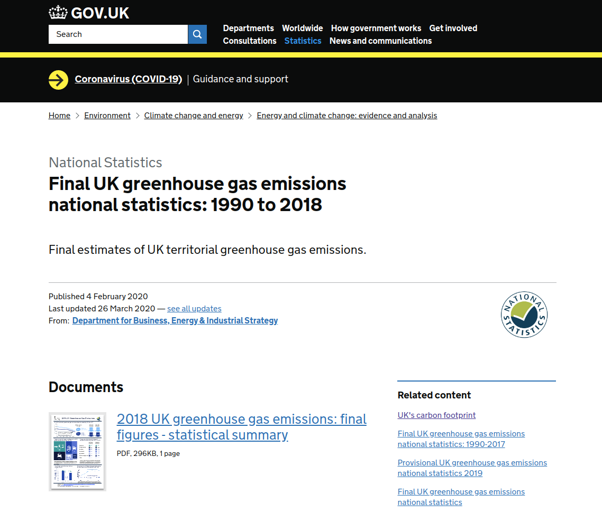

<style type="text/css">
.main-container {
  max-width: 1200px;
  margin-left: auto;
  margin-right: auto;
}
</style>

<br/>
<br/>

```{r setup, include=FALSE}
knitr::opts_chunk$set(echo = TRUE)

library(openxlsx)

options(scipen = 999)
seaborn_palette <- c("#4C72B0", "#DD8452", "#55A868", "#C44E52", "#8172B3",
                     "#937860", "#DA8BC3", "#8C8C8C", "#CCB974", "#64B5CD")
```


<div style="text-align:center"></div>


```{r}
url <- paste0('https://assets.publishing.service.gov.uk/government/uploads/system/uploads/',
              'attachment_data/file/875508/final-greenhouse-gas-emissions-tables-2018.xlsx')

xl_file <- '~/Downloads/final-greenhouse-gas-emissions-tables-2018.xlsx'
sheet_names <- getSheetNames(xl_file)

uk_ghg_tables <- sapply(sheet_names[2:24], function(tbl) read.xlsx(xl_file, sheet=tbl, startRow=3))
```

```{r}
table_desc <- within(subset(setNames(read.xlsx(xl_file, sheet="Contents", startRow=11, colNames=FALSE),
                                     c("Table", "Table Description")), !is.na(Table)), {
                                       `Table Description` <- paste(Table, "-", `Table Description`)
                                       rm(Table)
                                     })
data.frame(Table = table_desc$`Table Description`)
```

### Table 1: Estimated territorial greenhouse gas emissions by gas, UK 1990-2018

```{r}
uk_ghg_df <- uk_ghg_tables$`Table 1`[c(1:8),]

uk_ghg_df <- within(uk_ghg_df, {
  Gas <- trimws(Gas)  
  Gas <- ifelse(Gas == "Net CO2 emissions (emissions minus removals)", "Net CO2 emissions", Gas)
})

uk_ghg_df
```

```{r fig1a, fig.height = 24, fig.width = 13, fig.align = "center"}
par(mar = c(5,6,4,2), mfrow=c(nrow(uk_ghg_df), 1), las=1)

output <- by(uk_ghg_df, uk_ghg_df$Gas, function(sub) {
  color <- as.integer(row.names(sub))
  dat <- as.matrix(sub[-1])
  
  barplot(dat, beside = TRUE, 
          main = paste(sub$`Gas`[1], "Emissions"),
          ylab = "MtCO2e\n", ylim=range(pretty(c(0, dat))),
          cex.lab=1.5, cex.main=1.8, cex.axis=1.5,
          col=seaborn_palette[color])
})
```

### Table 2: Estimated territorial greenhouse gas emissions by geographical coverage and gas, 1990-2018

```{r}

uk_ghg_df <- setNames(uk_ghg_tables$`Table 2`[c(1:78),],
                      c("Geographic Coverage", "Gas Coverage", "Gas", 1990:2018))

uk_ghg_df <- within(uk_ghg_df, {
  `Geographic Coverage_` <- ifelse(is.na(`Geographic Coverage`), "Blank", `Geographic Coverage`)
  `Geographic Coverage_` <- cummax(as.integer(factor(`Geographic Coverage_`, levels=c("Blank", unique(`Geographic Coverage`)))))
  `Geographic Coverage_` <- factor(`Geographic Coverage_`, labels=unique(`Geographic Coverage`[which(!is.na(`Geographic Coverage`))]))
  `Geographic Coverage`  <- `Geographic Coverage_`
  
  `Gas Coverage`  <- ifelse(is.na(`Gas Coverage`), NA, paste0(`Geographic Coverage_`, `Gas Coverage`))
  `Gas Coverage_` <- ifelse(is.na(`Gas Coverage`), "Blank", `Gas Coverage`)
  `Gas Coverage_` <- cummax(as.integer(factor(`Gas Coverage_`, levels=c("Blank", unique(`Gas Coverage`)))))
  `Gas Coverage_` <- factor(`Gas Coverage_`, labels=unique(`Gas Coverage`[which(!is.na(`Gas Coverage`))]))
  `Gas Coverage`  <- as.character(`Gas Coverage_`)
  `Gas Coverage`  <- mapply(function(x, y) sub(x, "", y), `Geographic Coverage`, `Gas Coverage`)
  `Gas Coverage`  <- gsub("UK Crown Dependencies|Overseas Territories", "", `Gas Coverage`)
  
  rm(`Geographic Coverage_`, `Gas Coverage_`)
})

uk_ghg_df <- `row.names<-`(subset(uk_ghg_df, `Gas Coverage` == "Including net emissions/removals from LULUCF" & 
                                    `Gas` == "Total"), 
                           NULL)
uk_ghg_df
```


```{r fig2a, fig.height = 24, fig.width = 13, fig.align = "center"}
par(mar = c(5,8,4,2), mfrow=c(nrow(uk_ghg_df), 1), las=1)

output <- by(uk_ghg_df, uk_ghg_df$`Geographic Coverage`, function(sub) {
  color <- as.integer(row.names(sub))
  dat <- as.matrix(sub[4:32])
  
  barplot(dat, beside = TRUE, 
          main = paste(sub$`Geographic Coverage`[1], " - Total Net Emissions"),
          ylab = "MtCO2e\n", ylim=range(pretty(c(0, dat))),
          cex.lab=1.5, cex.main=1.8, cex.axis=1.5,
          col=seaborn_palette[color])
})
```

```{r}
uk_ghg_long_df <- reshape(uk_ghg_df, varying=names(uk_ghg_df)[4:32], times=names(uk_ghg_df)[4:32],
                          v.names="Value", timevar="Year", ids=NULL,
                          drop=c("Gas Coverage", "Gas"),
                          new.row.names=1:1E4, direction="long")

head(uk_ghg_long_df, 10)
```


```{r fig2b, fig.height = 7, fig.width = 13, fig.align = "center"}

uk_ghg_long_df <- subset(uk_ghg_long_df, `Geographic Coverage` != "United Kingdom only")

with(subset(uk_ghg_long_df, `Geographic Coverage`=="UK Crown Dependencies"), {
  par(mar = c(5,6,4,2), las=1)
  
  plot(Year, Value, type='l', pch=20,
       main="Other U.K. Territories - Total Greehouse Gas Emissions",
       xlab="Year", ylab="Million metric tons of CO2e\n", font.lab=2,
       ylim=range(pretty(c(0, uk_ghg_long_df$Value))),
       col=seaborn_palette[1], lwd=2, 
       cex.main=1.5, cex.lab=1.5, cex.axis = 1.0)
})

output <- by(uk_ghg_long_df, uk_ghg_long_df$`Geographic Coverage`, function(sub) {
   lines(sub$Year, sub$Value, col=seaborn_palette[as.integer(sub$`Geographic Coverage`)])  
   points(sub$Year, sub$Value, pch=20, col=seaborn_palette[as.integer(sub$`Geographic Coverage`)]) 
})

legend("topleft", legend=unique(uk_ghg_long_df$`Geographic Coverage`),
       col=seaborn_palette, lty=1, cex=0.75)

```

### Table 3: Estimated territorial greenhouse gas emissions by source category, 1990-2018

```{r}
uk_ghg_df <- data.frame(subset(uk_ghg_tables$`Table 3`[c(1:122),],
                               is.na(More.Detail)), 
                        check.names = FALSE, row.names=NULL)

uk_ghg_df
```


```{r fig3a, fig.height = 24, fig.width = 13, fig.align = "center"}
par(mar = c(5,8,4,2), mfrow=c(nrow(uk_ghg_df), 1), las=1)

output <- by(uk_ghg_df, uk_ghg_df$`Sector`, function(sub) {
  color <- as.integer(row.names(sub))
  dat <- as.matrix(sub[3:31])
  
  barplot(dat, beside = TRUE, 
          main = paste(sub$`Sector`[1], " - Total Net Emissions"),
          ylab = "MtCO2e\n", ylim=range(pretty(c(0, dat))),
          cex.lab=1.5, cex.main=1.8, cex.axis=1.5,
          col=seaborn_palette[color])
})
```


```{r}
uk_ghg_long_df <- reshape(uk_ghg_df, varying=names(uk_ghg_df)[3:31], times=names(uk_ghg_df)[3:31],
                          v.names="Value", timevar="Year", ids=NULL, drop="More.Detail",
                          new.row.names=1:1E4, direction="long")

uk_ghg_long_df$Sector <- with(uk_ghg_long_df, factor(Sector, labels=unique(Sector)))

head(uk_ghg_long_df, 10)
```

```{r fig3b, fig.height = 7, fig.width = 13, fig.align = "center"}

with(subset(uk_ghg_long_df, Sector=="Energy supply"), {
  par(mar = c(5,6,4,2), las=1)
  
  plot(Year, Value, type='l', pch=20,
       main="U.K. Total Greehouse Gas Emissions by Sector",
       xlab="Year", ylab="Million metric tons of CO2e", font.lab=2,
       ylim=range(pretty(c(0, uk_ghg_long_df$Value))),
       col=seaborn_palette[1], lwd=2, 
       cex.main=1.5, cex.lab=1.5, cex.axis = 1.0)
})

output <- by(uk_ghg_long_df, uk_ghg_long_df$Sector, function(sub) {
   lines(sub$Year, sub$Value, col=seaborn_palette[as.integer(sub$Sector)])  
   points(sub$Year, sub$Value, pch=20, col=seaborn_palette[as.integer(sub$Sector)]) 
})

legend("topright", legend=unique(uk_ghg_long_df$Sector),
       col=seaborn_palette, lty=1, cex=0.75)

```


<br/>
<br/>
<br/>

