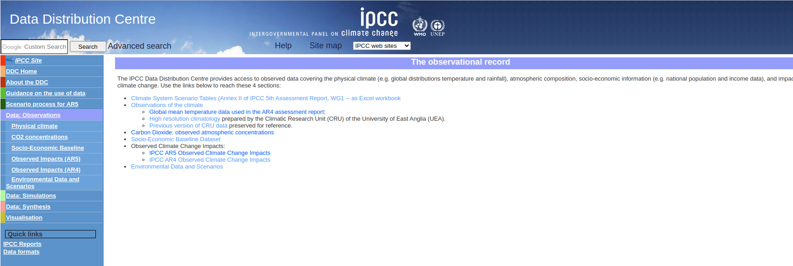

<style type="text/css">
.main-container {
  max-width: 1200px;
  margin-left: auto;
  margin-right: auto;
}
</style>

<br/>
<br/>

```{r setup, include=FALSE}
knitr::opts_chunk$set(echo = TRUE)

library(openxlsx)

seaborn_palette <- c("#4C72B0", "#DD8452", "#55A868", "#C44E52", "#8172B3",
                     "#937860", "#DA8BC3", "#8C8C8C", "#CCB974", "#64B5CD")
```

<div style="text-align:center"></div>


### Climate System Scenario Tables (Annex II of IPCC 5th Assessment Report, WG1)

```{r}
url <- 'http://www.climatechange2013.org/images/report/WG1AR5_AIISM_Datafiles.xlsx'
xl_file <- '~/Downloads/WG1AR5_AIISM_Datafiles.xlsx'

sheet_names <- getSheetNames(xl_file)

all_tables <- read.xlsx(xl_file, sheet="AII-Tables", startRow = 8)

scenario_tables <- sapply(sheet_names[7:74], function(tbl) read.xlsx(xl_file, sheet=tbl, startRow=8))
```

```{r, echo=FALSE}
data.frame(`Scenario Tables` = all_tables$Tables)
```


## Table AII.1.1a: Historical abundances of the Kyoto greenhouse gases


```{r}
climate_df <- data.frame(setNames(scenario_tables$`AII-1-1a`[c(2:98), c("Year", "CO2.(ppm)", "CH4.(ppb)", "N2O.(ppb)")],
                                  c("year", "co2_ppm", "ch4_ppb", "n2o_ppb")),
                         row.names = NULL)

climate_df <- within(climate_df, {
  year <- as.integer(year)
  co2_ppm <- as.numeric(co2_ppm)
  ch4_ppb <- as.numeric(ch4_ppb)
  n2o_ppb <- as.numeric(n2o_ppb)
})

climate_df
```

```{r echo=FALSE}
climate_long_df <- reshape(climate_df, varying = names(climate_df)[-1], times = names(climate_df)[-1],
                           v.names = "value", timevar = "ghg", idvar = "year",
                           new.row.names = 1:1E3, direction = "long")

climate_long_df$ghg <- as.factor(climate_long_df$ghg)
```


```{r fig1, fig.height = 16, fig.width = 13, fig.align = "center"}
par(mar = c(5,5,3,2), mfrow=c(3,1))

output <- by(climate_long_df, climate_long_df$ghg, function(sub) {
  plot(sub$year, sub$value, type='l', pch=16,
       main=paste0("Historical Abundance of Kyoto Green House Gases - ", 
                  sub("_", " (", toupper(sub$ghg[1])), ")"),
       xlab="Year", ylab="Carbon PPM", font.lab=2,
       col=seaborn_palette, lwd=2, 
       cex.main=1.75, cex.lab=1.5, cex.axis = 1.5)
})
```


## Table AII.2.1a: Anthropogenic CO2 emissions from fossil fuels and other industrial sources (FF) (PgC yr–1)

```{r}
climate_df <- data.frame(scenario_tables$`AII-2-1abc`[c(1:11), c("Year", "RCP2.6", "RCP4.5", "RCP6.0", "RCP8.5")],
                         row.names=NULL)

climate_df <- within(climate_df, {
  Year <- as.integer(Year)
  RCP2.6 <- as.numeric(RCP2.6)
  RCP4.5 <- as.numeric(RCP4.5)
  RCP6.0 <- as.numeric(RCP6.0)
  RCP8.5 <- as.numeric(RCP8.5)
})

climate_df
```


```{r fig2a, fig.height = 6, fig.width = 13, fig.align = "center"}
par(mar = c(5,5,4,2))

with(climate_df,  {
  plot(Year, RCP8.5, type='l', pch=16,
       main="Anthropogenic CO2 emissions from\nFossil Fuels and Other Industrial Sources",
       xlab="Year", ylab="RCP Decadal Mean", font.lab=2,
       col=seaborn_palette[1], lwd=2, 
       cex.main=1.5, cex.lab=1.5, cex.axis = 1.5)
  points(Year, RCP8.5, pch=16, col=seaborn_palette[1])
  
  lines(Year, RCP6.0, col=seaborn_palette[2])
  points(Year, RCP6.0, pch=16, col=seaborn_palette[2])
  
  lines(Year, RCP4.5, col=seaborn_palette[3])
  points(Year, RCP4.5, pch=16, col=seaborn_palette[3])
  
  lines(Year, RCP2.6, col=seaborn_palette[4])
  points(Year, RCP2.6, pch=16, col=seaborn_palette[4])
  
  legend("topleft", legend=names(climate_df)[-1],
         col=seaborn_palette[1:4], lty=1, cex=1.0)
})

```


### Table AII.2.1b: Anthropogenic CO2 emissions from agriculture, forestry, land use (AFOLU) (PgC yr–1)

```{r}
climate_df <- data.frame(scenario_tables$`AII-2-1abc`[c(19:29), c("Year", "RCP2.6", "RCP4.5", "RCP6.0", "RCP8.5")],
                         row.names=NULL)

climate_df <- within(climate_df, {
  Year <- as.integer(Year)
  RCP2.6 <- as.numeric(RCP2.6)
  RCP4.5 <- as.numeric(RCP4.5)
  RCP6.0 <- as.numeric(RCP6.0)
  RCP8.5 <- as.numeric(RCP8.5)
})

climate_df
```

```{r fig2b, fig.height = 6, fig.width = 13, fig.align = "center"}
par(mar = c(5,5,4,2))

with(climate_df,  {
  plot(Year, RCP8.5, type='l', pch=16,
       main="Anthropogenic CO2 emissions from\nAgriculture, Forestry, Land use",
       xlab="Year", ylab="RCP Decadal Mean", font.lab=2,
       col=seaborn_palette[1], lwd=2, 
       cex.main=1.5, cex.lab=1.5, cex.axis = 1.5)
  points(Year, RCP8.5, pch=16, col=seaborn_palette[1])
  
  lines(Year, RCP6.0, col=seaborn_palette[2])
  points(Year, RCP6.0, pch=16, col=seaborn_palette[2])
  
  lines(Year, RCP4.5, col=seaborn_palette[3])
  points(Year, RCP4.5, pch=16, col=seaborn_palette[3])
  
  lines(Year, RCP2.6, col=seaborn_palette[4])
  points(Year, RCP2.6, pch=16, col=seaborn_palette[4])
  
  legend("topright", legend=names(climate_df)[-1],
         col=seaborn_palette[4:1], lty=1, cex=1.0)
})

```

### Table AII.2.1c: Anthropogenic total CO2 emissions (PgC yr–1)

```{r}
climate_df <- data.frame(scenario_tables$`AII-2-1abc`[c(34:44), c("Year", "RCP2.6", "RCP4.5", "RCP6.0", "RCP8.5")],
                         row.names=NULL)

climate_df <- within(climate_df, {
  Year <- as.integer(Year)
  RCP2.6 <- as.numeric(RCP2.6)
  RCP4.5 <- as.numeric(RCP4.5)
  RCP6.0 <- as.numeric(RCP6.0)
  RCP8.5 <- as.numeric(RCP8.5)
})

climate_df
```

```{r fig2c, fig.height = 6, fig.width = 13, fig.align = "center"}
par(mar = c(5,5,4,2))

with(climate_df,  {
  plot(Year, RCP8.5, type='l', pch=16,
       main="Anthropogenic Total CO2 Emissions",
       xlab="Year", ylab="RCP Decadal Mean", font.lab=2,
       col=seaborn_palette[1], lwd=2, 
       cex.main=1.5, cex.lab=1.5, cex.axis = 1.5)
  points(Year, RCP8.5, pch=16, col=seaborn_palette[1])
  
  lines(Year, RCP6.0, col=seaborn_palette[2])
  points(Year, RCP6.0, pch=16, col=seaborn_palette[2])
  
  lines(Year, RCP4.5, col=seaborn_palette[3])
  points(Year, RCP4.5, pch=16, col=seaborn_palette[3])
  
  lines(Year, RCP2.6, col=seaborn_palette[4])
  points(Year, RCP2.6, pch=16, col=seaborn_palette[4])
  
  legend("topleft", legend=names(climate_df)[-1],
         col=seaborn_palette[4:1], lty=1, cex=1.0)
})

```


## Table AII.2.2: Anthropogenic CH4 emissions (Tg yr–1)

```{r}
climate_df <- data.frame(scenario_tables$`AII-2-2`[c(4:13), c("Year", "RCP2.6", "RCP4.5", "RCP6.0", "RCP8.5")],
                         row.names = NULL)

climate_df <- within(climate_df, {
  Year <- as.integer(Year)
  RCP2.6 <- as.numeric(RCP2.6)
  RCP4.5 <- as.numeric(RCP4.5)
  RCP6.0 <- as.numeric(RCP6.0)
  RCP8.5 <- as.numeric(RCP8.5)
})

climate_df
```

```{r fig3, fig.height = 6, fig.width = 13, fig.align = "center"}
par(mar = c(5,5,4,2))

with(climate_df,  {
  plot(Year, RCP8.5, type='l', pch=16,
       main="Anthropogenic CH4 (Methane) Emissions",
       xlab="Year", ylab="RCP Decadal Mean", font.lab=2,
       col=seaborn_palette[1], lwd=2, 
       cex.main=1.5, cex.lab=1.5, cex.axis = 1.5)
  points(Year, RCP8.5, pch=16, col=seaborn_palette[1])
  
  lines(Year, RCP6.0, col=seaborn_palette[2])
  points(Year, RCP6.0, pch=16, col=seaborn_palette[2])
  
  lines(Year, RCP4.5, col=seaborn_palette[3])
  points(Year, RCP4.5, pch=16, col=seaborn_palette[3])
  
  lines(Year, RCP2.6, col=seaborn_palette[4])
  points(Year, RCP2.6, pch=16, col=seaborn_palette[4])
  
  legend("topleft", legend=names(climate_df)[-1],
         col=seaborn_palette[4:1], lty=1, cex=1.0)
})

```

## Table AII.2.3: Anthropogenic N2O emissions (TgN yr–1)

```{r}
climate_df <- data.frame(scenario_tables$`AII-2-3`[c(4:13), c("Year", "RCP2.6", "RCP4.5", "RCP6.0", "RCP8.5")],
                         row.names = NULL)

climate_df <- within(climate_df, {
  Year <- as.integer(Year)
  RCP2.6 <- as.numeric(RCP2.6)
  RCP4.5 <- as.numeric(RCP4.5)
  RCP6.0 <- as.numeric(RCP6.0)
  RCP8.5 <- as.numeric(RCP8.5)
})

climate_df
```

```{r fig4, fig.height = 6, fig.width = 13, fig.align = "center"}
par(mar = c(5,5,4,2))

with(climate_df,  {
  plot(Year, RCP8.5, type='l', pch=16,
       main="Anthropogenic N2O Emissions",
       xlab="Year", ylab="RCP Decadal Mean", font.lab=2,
       col=seaborn_palette[1], lwd=2, 
       cex.main=1.5, cex.lab=1.5, cex.axis = 1.5)
  points(Year, RCP8.5, pch=16, col=seaborn_palette[1])
  
  lines(Year, RCP6.0, col=seaborn_palette[2])
  points(Year, RCP6.0, pch=16, col=seaborn_palette[2])
  
  lines(Year, RCP4.5, col=seaborn_palette[3])
  points(Year, RCP4.5, pch=16, col=seaborn_palette[3])
  
  lines(Year, RCP2.6, col=seaborn_palette[4])
  points(Year, RCP2.6, pch=16, col=seaborn_palette[4])
  
  legend("topleft", legend=names(climate_df)[-1],
         col=seaborn_palette[4:1], lty=1, cex=1.0)
})

```

## Table AII.4.1: CO2 abundance (ppm)

```{r}
climate_df <- data.frame(scenario_tables$`AII-4-1`[c(4:13), c("Year", "RCP2.6", "RCP4.5", "RCP6.0", "RCP8.5")],
                         row.names=NULL)

climate_df <- within(climate_df, {
  Year <- as.integer(Year)
  RCP2.6 <- as.numeric(RCP2.6)
  RCP4.5 <- as.numeric(RCP4.5)
  RCP6.0 <- as.numeric(RCP6.0)
  RCP8.5 <- as.numeric(RCP8.5)
})

climate_df
```

```{r fig5, fig.height = 6, fig.width = 13, fig.align = "center"}
par(mar = c(5,5,4,2))

with(climate_df,  {
  plot(Year, RCP8.5, type='l', pch=16,
       main="CO2 Abundance",
       xlab="Year", ylab="PPM", font.lab=2,
       col=seaborn_palette[1], lwd=2, 
       cex.main=1.5, cex.lab=1.5, cex.axis = 1.5)
  points(Year, RCP8.5, pch=16, col=seaborn_palette[1])
  
  lines(Year, RCP6.0, col=seaborn_palette[2])
  points(Year, RCP6.0, pch=16, col=seaborn_palette[2])
  
  lines(Year, RCP4.5, col=seaborn_palette[3])
  points(Year, RCP4.5, pch=16, col=seaborn_palette[3])
  
  lines(Year, RCP2.6, col=seaborn_palette[4])
  points(Year, RCP2.6, pch=16, col=seaborn_palette[4])
  
  legend("topleft", legend=names(climate_df)[-1],
         col=seaborn_palette[4:1], lty=1, cex=1.0)
})

```

## Table AII.4.2: CH4 abundance (ppb)

```{r}
climate_df <- data.frame(scenario_tables$`AII-4-2`[c(4:13), c("Year", "RCP2.6", "RCP4.5", "RCP6.0", "RCP8.5")],
                         row.names = NULL)

climate_df <- within(climate_df, {
  Year <- as.integer(Year)
  RCP2.6 <- as.numeric(RCP2.6)
  RCP4.5 <- as.numeric(RCP4.5)
  RCP6.0 <- as.numeric(RCP6.0)
  RCP8.5 <- as.numeric(RCP8.5)
})

climate_df
```

```{r fig6, fig.height = 6, fig.width = 13, fig.align = "center"}
par(mar = c(5,5,4,2))

with(climate_df,  {
  plot(Year, RCP8.5, type='l', pch=16,
       main="CH4 Abundance",
       xlab="Year", ylab="PPB", font.lab=2,
       col=seaborn_palette[1], lwd=2, 
       cex.main=1.5, cex.lab=1.5, cex.axis = 1.5)
  points(Year, RCP8.5, pch=16, col=seaborn_palette[1])
  
  lines(Year, RCP6.0, col=seaborn_palette[2])
  points(Year, RCP6.0, pch=16, col=seaborn_palette[2])
  
  lines(Year, RCP4.5, col=seaborn_palette[3])
  points(Year, RCP4.5, pch=16, col=seaborn_palette[3])
  
  lines(Year, RCP2.6, col=seaborn_palette[4])
  points(Year, RCP2.6, pch=16, col=seaborn_palette[4])
  
  legend("topleft", legend=names(climate_df)[-1],
         col=seaborn_palette[4:1], lty=1, cex=1.0)
})

```

## Table AII.4.3: N2O abundance (ppb)

```{r}
climate_df <- data.frame(scenario_tables$`AII-4-3`[c(4:13), c("Year", "RCP2.6", "RCP4.5", "RCP6.0", "RCP8.5")],
                         row.names = NULL)

climate_df <- within(climate_df, {
  Year <- as.integer(Year)
  RCP2.6 <- as.numeric(RCP2.6)
  RCP4.5 <- as.numeric(RCP4.5)
  RCP6.0 <- as.numeric(RCP6.0)
  RCP8.5 <- as.numeric(RCP8.5)
})

climate_df
```

```{r fig7, fig.height = 6, fig.width = 13, fig.align = "center"}
par(mar = c(5,5,4,2))

with(climate_df,  {
  plot(Year, RCP8.5, type='l', pch=16,
       main="N20 Abundance",
       xlab="Year", ylab="PPB", font.lab=2,
       col=seaborn_palette[1], lwd=2, 
       cex.main=1.5, cex.lab=1.5, cex.axis = 1.5)
  points(Year, RCP8.5, pch=16, col=seaborn_palette[1])
  
  lines(Year, RCP6.0, col=seaborn_palette[2])
  points(Year, RCP6.0, pch=16, col=seaborn_palette[2])
  
  lines(Year, RCP4.5, col=seaborn_palette[3])
  points(Year, RCP4.5, pch=16, col=seaborn_palette[3])
  
  lines(Year, RCP2.6, col=seaborn_palette[4])
  points(Year, RCP2.6, pch=16, col=seaborn_palette[4])
  
  legend("topleft", legend=names(climate_df)[-1],
         col=seaborn_palette[4:1], lty=1, cex=1.0)
})

```


<br/>
<br/>
<br/>


