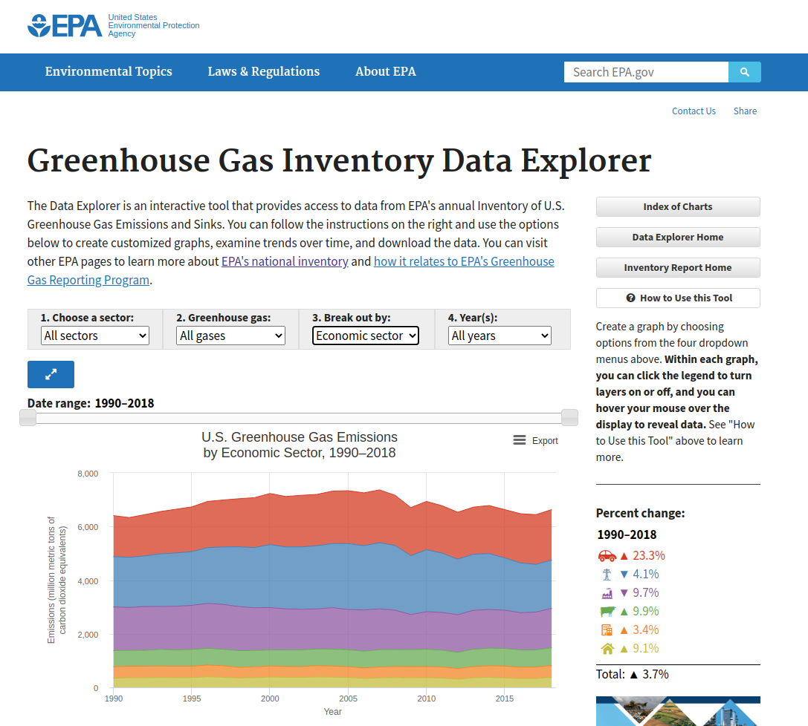

<style type="text/css">
.main-container {
  max-width: 1200px;
  margin-left: auto;
  margin-right: auto;
}
</style>

<br/>
<br/>

```{r setup, include=FALSE}
knitr::opts_chunk$set(echo = TRUE)

options(scipen=999)

seaborn_palette <- rep(c("#4C72B0", "#DD8452", "#55A868", "#C44E52", "#8172B3",
                         "#937860", "#DA8BC3", "#8C8C8C", "#CCB974", "#64B5CD"), 4)
```

<div style="text-align:center"></div>

### GreenHouse Gases by Economic Sector

```{r}
url <- 'https://cfpub.epa.gov/ghgdata/inventoryexplorer/#'

us_ghg_economic_sector_df <- read.csv('~/Downloads/data.csv', check.names=FALSE)
us_ghg_economic_sector_df
```

```{r fig1a, fig.height = 24, fig.width = 12, fig.align = "center"}
par(mar = c(5,6,4,2), mfrow=c(nrow(us_ghg_economic_sector_df), 1), las=1)

output <- by(us_ghg_economic_sector_df, us_ghg_economic_sector_df$`Economic Sector`, function(sub) {
  
  dat <- as.matrix(sub[-1])
  
  barplot(dat, beside = TRUE, ylim=range(pretty(c(0, dat))),
          main = paste("U.S. Greenhouse Gases -", sub$`Economic Sector`[1], "Emissions"),
          ylab = "Million metric tons of CO2e\n", cex.lab=1.5, cex.main=1.8, cex.axis=1.5,
          col=seaborn_palette)
})
```

```{r}
us_ghg_economic_sector_long_df <- reshape(us_ghg_economic_sector_df, varying=names(us_ghg_economic_sector_df)[-1], 
                                           times=names(us_ghg_economic_sector_df)[-1],
                                           v.names="Value", timevar="Year", ids=NULL,
                                           new.row.names=1:1E4, direction="long")

us_ghg_economic_sector_long_df <- within(us_ghg_economic_sector_long_df, {
  `Economic Sector` <- as.factor(`Economic Sector`)
})

head(us_ghg_economic_sector_long_df, 10)
```

```{r fig1b, fig.height = 7, fig.width = 13, fig.align = "center"}

with(subset(us_ghg_economic_sector_long_df, `Economic Sector`=="Agriculture"), {
  par(mar = c(5,6,4,2), las=1)
  
  plot(Year, Value, type='l', pch=16,
       main="U.S. Greehouse Gas Emissions by Economic Sector",
       xlab="Year", ylab="Million metric tons of CO2e\n", font.lab=2,
       ylim=range(pretty(c(0, us_ghg_economic_sector_long_df$Value))),
       col=seaborn_palette[1], lwd=2, 
       cex.main=1.5, cex.lab=1.5, cex.axis = 1.0)
})

output <- by(us_ghg_economic_sector_long_df, us_ghg_economic_sector_long_df$`Economic Sector`, function(sub) {
   lines(sub$Year, sub$Value, col=seaborn_palette[as.integer(sub$`Economic Sector`)])  
   points(sub$Year, sub$Value, pch=16, col=seaborn_palette[as.integer(sub$`Economic Sector`)]) 
})

legend("topleft", legend=unique(us_ghg_economic_sector_long_df$`Economic Sector`),
       col=seaborn_palette, lty=1, cex=0.75)

```

### GreenHouse Gases by Inventory Sector

```{r}
us_ghg_inventory_sector_df <- read.csv('~/Downloads/data (1).csv', check.names=FALSE)
us_ghg_inventory_sector_df
```

```{r fig2a, fig.height = 24, fig.width = 12, fig.align = "center"}
par(mar = c(5,6,4,2), mfrow=c(nrow(us_ghg_inventory_sector_df), 1), las=1)

output <- by(us_ghg_inventory_sector_df, us_ghg_inventory_sector_df$`IPCC Sector`, function(sub) {
  
  dat <- as.matrix(sub[-1])
  
  barplot(dat, beside = TRUE, ylim=range(pretty(c(0, dat))),
          main = paste("U.S. Greenhouse Gases -", sub$`IPCC Sector`[1], "Emissions"),
          ylab = "Million metric tons of CO2e\n", cex.lab=1.5, cex.main=1.8, cex.axis=1.5,
          col=seaborn_palette)
})
```
```{r}
us_ghg_inventory_sector_long_df <- reshape(us_ghg_inventory_sector_df, varying=names(us_ghg_inventory_sector_df)[-1], 
                                           times=names(us_ghg_inventory_sector_df)[-1],
                                           v.names="Value", timevar="Year", ids=NULL,
                                           new.row.names=1:1E4, direction="long")

us_ghg_inventory_sector_long_df <- within(us_ghg_inventory_sector_long_df, {
  `IPCC Sector` <- as.factor(gsub("Land use, land-use change, and forestry", "Land use, etc.", `IPCC Sector`))
})

head(us_ghg_inventory_sector_long_df, 10)
```

```{r fig2b, fig.height = 7, fig.width = 13, fig.align = "center"}

with(subset(us_ghg_inventory_sector_long_df, `IPCC Sector`=="Agriculture"), {
  par(mar = c(5,6,4,2), las=1)
  
  plot(Year, Value, type='l', pch=16,
       main="U.S. Greehouse Gas Emissions by Inventory Sector",
       xlab="Year", ylab="Million metric tons of CO2e\n", font.lab=2,
       ylim=range(pretty(c(0, us_ghg_inventory_sector_long_df$Value))),
       col=seaborn_palette[1], lwd=2, 
       cex.main=1.5, cex.lab=1.5, cex.axis = 1.0)
})

output <- by(us_ghg_inventory_sector_long_df, us_ghg_inventory_sector_long_df$`IPCC Sector`, function(sub) {
   lines(sub$Year, sub$Value, col=seaborn_palette[as.integer(sub$`IPCC Sector`)])  
   points(sub$Year, sub$Value, pch=16, col=seaborn_palette[as.integer(sub$`IPCC Sector`)])  
})

legend("topleft", legend=sort(unique(as.character(us_ghg_inventory_sector_long_df$`IPCC Sector`))),
       col=seaborn_palette, lty=1, cex=0.75)

```


### GreenHouse Gases by Gas

```{r}
us_ghg_gas_df <- read.csv('~/Downloads/data (2).csv', check.names=FALSE)
us_ghg_gas_df 
```

```{r fig3a, fig.height = 24, fig.width = 12, fig.align = "center"}
par(mar = c(5,6,4,2), mfrow=c(nrow(us_ghg_gas_df), 1), las=1)

output <- by(us_ghg_gas_df, us_ghg_gas_df$Gas, function(sub) {
  
  dat <- as.matrix(sub[-1])
  
  barplot(dat, beside = TRUE, ylim=range(pretty(c(0, dat))),
          main = paste("U.S. Greenhouse Gases -", sub$Gas[1], "Emissions"),
          ylab = "Million metric tons of CO2e\n", cex.lab=1.5, cex.main=1.8, cex.axis=1.5,
          col=seaborn_palette)
})
```


```{r}
us_ghg_gas_long_df <- reshape(us_ghg_gas_df, varying=names(us_ghg_gas_df)[-1], 
                              times=names(us_ghg_gas_df)[-1],
                              v.names="Value", timevar="Year", ids=NULL,
                              new.row.names=1:1E4, direction="long")

us_ghg_gas_long_df$Gas <- as.factor(us_ghg_gas_long_df$Gas)
head(us_ghg_gas_long_df, 10)
```

```{r fig3b, fig.height = 7, fig.width = 13, fig.align = "center"}

with(subset(us_ghg_gas_long_df, Gas=="Carbon dioxide"), {
  par(mar = c(5,6,4,2), las=1)
  
  plot(Year, Value, type='l', pch=16,
       main="U.S. Greehouse Gas Emissions by Gas",
       xlab="Year", ylab="Million metric tons of CO2e\n", font.lab=2,
       ylim=range(pretty(c(0, us_ghg_gas_long_df$Value))),
       col=seaborn_palette[1], lwd=2, 
       cex.main=1.5, cex.lab=1.5, cex.axis = 1.0)
})

output <- by(us_ghg_gas_long_df, us_ghg_gas_long_df$Gas, function(sub) {
   lines(sub$Year, sub$Value, col=seaborn_palette[as.integer(sub$Gas)])  
   points(sub$Year, sub$Value, pch=16, col=seaborn_palette[as.integer(sub$Gas)])  
})

legend("topleft", legend=sort(unique(as.character(us_ghg_gas_long_df$Gas))),
       col=seaborn_palette, lty=1, cex=0.75)
```


<br/>
<br/>
<br/>

